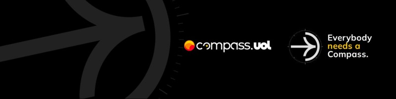

# Programa de bolsas - Compass UOL

Repositório destinado ao registro das atividades e desafios realizados durante a formação em Cloud Data Engineering com foco em AWS cedido pela Compass UOL. 


## Sobre mim

### Olá 👋, eu sou a **Lívia Mabelle**


```
🎂 Tenho 21 anos

📌 Resido em Barbalha, interior do Ceará

🎓 Graduanda do 7° semestre do curso de Sistemas de Informação na UNINASSAU Juazeiro do Norte

👩🏽‍🎓 Técnica em Redes de Computadores 

🏥 Já realizei estágio no Núcleo de Tecnologia do Hospital Regional do Cariri como suporte técnico

🌻 Adoro animais, filmes e as artes de Van Gogh

👩🏽‍💻 Atualmente, estudo desenvolvimento Front-end

```

<div align="center"> 
  <a href = "mailto:liviamabelle@gmail.com"></a>
  <a href="https://www.linkedin.com/in/livia--alves" target="_blank"></a> 
  <a href="mailto:livia.alves.pb@compasso.com.br" target="_blank"></a> 
</div>

## Trilha D&A - AWS  

### Sprint 1

### Sprint 2

### Sprint 3

### Sprint 4

### Sprint 5

### Sprint 6

### Sprint 7

### Sprint 8

### Sprint 9

### Sprint 10


## Desafio
