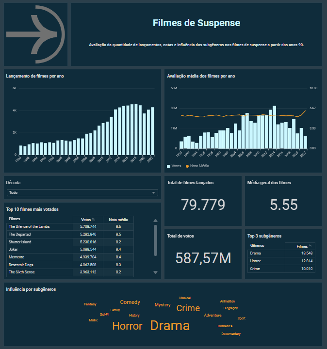

# Projeto Final

- Abaixo, descreve-se todo o processo de desenvolvimento do desafio final com base nos **filmes de suspense**, desde a coleta e inclusão dos dados no datalake, passando pelas transformações necessárias até a construção do dashboard.

## Parte 1 

- Criando código Python que carrega arquivos CSV para a Nuvem utilizando técnicas de ETL.

1. O seguinte código python implementa o processso de upload dos dois arquivos disponibilizados do tipo csv (movies.csv e series.csv) para um bucket S3 na AWS utilizando a lib boto3 e seguindo o padrão de exemplo **S3:\\data-lake-da-livia\Raw\Local\CSV\Series\2024\02\19\series.csv** para salvamento dos dados.

- [Código Python](parte_1/upload_aws/upload_s3.py)

Para funcionanmento do código, deve ser inserido no arquivo *chaves_aws.py* as suas respectivas credenciais AWS. Assim como no primeiro código, deve ser alterado o nome do bucket para o seu de referência. 

- [Código Python - Chaves_AWS](parte_1/upload_aws/chaves_aws.py)

Complementar, os arquivos abaixo auxiliam na criação da imagem docker:

- [Dockerfile](parte_1/upload_aws/Dockerfile)
- [Requirements](parte_1/upload_aws/requirements.txt)

Para realizar o upload dos arquivos, foi criada uma pasta chamada *dados* que armazenava os dois arquivos, movies.csv e series.csv, para compartilhamento no volume do Docker.

2. Logo após foi criado a imagem docker utilizando o comado `docker build -t upload-s3 .`, excecutando localmente o container *up-dados-s3* através do comando `docker run --name up-dados-s3 -v dados:/app/arquivos_csv upload-s3`.

> Criando imagem upload-s3 no Docker

> Executando container Docker

> Upload dos arquivos nas respectivas pastas no bucket S3  

## Parte 2

- Capturando dados da API TMBD com AWS Lambda e persistindo-os na RAW Zone do Amazon S3.

1. Foi realizado a criação de nova camada (layer) no AWS Lambda para as libs necessárias à ingestão de dados. 

Para o funcionamento do código na função Lambda, foi necessário criar um arquivo zip contendo a biblioteca "requests", sendo a criação realizada por meio de uma imagem Docker. Após o arquivo zip gerado, este foi enviado para o Amazon S3 para armazenamento. Em seguida, a camada **Layer-tmbd** foi criada no AWS Lambda.

2. Implementando o código Python no AWS Lambda para consumo de dados do TMDB. 

A função lambda **dados-api-tmdb** foi criada com utilização da camada *Layer-tmbd*. O código python logo foi inserido para requisitar a API e salvar dos dados no bucket S3, seguindo o padrão de exemplo "s3://data-lake-livia/Ram/tmdb/json/2024/02/24/data_53-{hora}.json".

Os dados requisitados à API tiveram como base a categoria **suspense**  a partir da década de 90, sendo solicitados individualmente para possibilitar o agrupamento por década.

- [Código Lambda](parte_2/codigo/dados-aws.py)

## Parte 3

- **Processamento da Camada Trusted**

> ➕ Para prosseguir com as etapas, foi necessário atualizar os dados referente aos arquivos movies e series, substituindo no código python da etapa 1 a opção "put_object" por "upload_file", garantindo a inclusão de todos os dados necessários nos arquivos CSV.

Avançando no desenvolvimento, os dados persistidos na camada RAM foram depurados e organizados para serem armazenados na camada Trusted. Utilizando o Google Colab, os dados do S3 presentes na camada RAM foram importados para o novo ambiente através das credenciais AWS e logo tratados. 

Para funcionamento dos códigos abaixo, é necessario fornecer suas credenciais e a chave do elemento no bucket S3.

O processamento foi realizado com base em cada conjunto de dados (Series, Movies e TMDB), seguindo os arquivos CSV e JSON. 

Ambos os códigos que processam a carga histórica realizam a leitura do arquivo CSV e armazenam os dados em um dataframe pandas. Em seguida, é realizado a limpeza dos caracteres '\N', sendo os dados realocados em um dataframe spark para melhor organização. Posteriomente, as colunas `genero`, `profissao` e `titulosMaisConhecidos` efetuam a separação das strings que estão nesse mesmo campo para arrays. Finalizando o processo, o DataFrame é salvo em formato Parquet, sem fracionamento e enviado para o bucket S3 na pasta especificada.

- [Código CH Movies](parte_3/codigos/CamadaTrusted_CH_Movies.ipynb)
- [Código CH Series](parte_3/codigos/CamadaTrusted_CH_Movies.ipynb)

Semelhante a carga anterior, a carga de dados foi processada com a junção em um único dataframe spark, após a leitura em um dataframe pandas. Logo após, ocorreu a limpeza dos dados, considerando apenas a chave `results` para salvamento no arquivo parquet. 

- [Código CD TMDB](parte_3/codigos/CamadaTrusted_CD_TMDB.ipynb)

> Puxando dados do S3 para processamento com o Google Colab

> Criando arquivo parquet e enviando ao S3

> Arquivos parquet criados no bucket S3 

- **Modelagem de dados da Refined**

Pensando no processamento dos dados para a camada Refined, foi realizado a modelagem dimensional que possibilitará a consulta dos dados em diferentes perpectivas. 

Levando em consideração as futuras questões a serem respondidas, o modelo desenvolvido expõe o fato principal sobre os filmes de suspense, com as dimensões gênero e filme, contendo suas principais informações.

Como ponto central, a análise será realizada com base nos dados gerais disponibilizados sobre filmes de suspense a partir da década de 90, apresentando as perspectivas: 

- _Como os lançamentos de filmes se distribuem ao longo dos anos?_ 
- _Como as médias de avaliação dos filmes de suspense se alteram ao longo dos anos?_ 
- _Qual a influência dos subgêneros nos filmes de suspense?_ 

- **Processamento da Camada Refined**

Após o processamento na camada trusted, procedeu-se ao processamento na camada refined, seguindo a modelagem dimensional estabelecida.

Realizou-se a leitura do arquivo Parquet da base de filmes, selecionando os campos necessários: `id`, `tituloPincipal`, `anoLancamento`, `genero`, `notaMedia` e `numeroVotos`, referentes aos filmes do gênero suspense.

Em seguida, realizou-se a filtragem para seleção desses filmes e, posteriormente, o salvamento ocorreu também em formato Parquet na pasta RFD no bucket S3, por meio do código executado pelo Google Colab.

- [Código Suspense](parte_3/codigos/CamadaRefined_Movies.ipynb)

> Selecionando as colunas necessárias 

> Arquivo parquet criado e enviado ao bucket S3 

## Parte 4

- Para consumo e apresentação dos dados, foi utilizado o serviço do AWS QuickSight.

> ➕ Considerando as próximas etapas do desenvolvimento do dashboard, em que o Amazon Quicksight não suporta arrays, foi realizado um novo processamento dos dados da trusted mantendo o campo gênero como string. 

Logo em seguida, foi criado o banco de dados `db-datalake` no AWS Glue, o qual recebeu as tabelas criadas pelo serviço Athena, utilizando como base o novo arquivo parquet gerado para a camada Refined.

Confirmando criação da tabela no banco.

Continuando com a utilização do Quicksight, por meio do Athena, foi realizado a criação do dataset `datafilmessuspense` para análise dos dados.

Ainda considerando a utilização das ferramentas do Amazon Quicksight, foi realizado a configuração do campo `anoLancamento` pelo serviço, de string para inteiro.

Para construção do dashboard, foi criado o protótipo pela ferramenta Excalidraw buscando atender as perpectivas esperadas.

Foi projetada a utilização de gráficos para apresentação de alguns dados, a criação de uma área interativa em que os dados podem ser filtrados e apresentados por década, de acordo com a escolha do usuário, e uma nuvem de palavras para melhor apresentação das influências. 

Já colocando em prática com as ferramentas fornecidas pelo QuickSight, a criação foi efetivada utilizando gráficos de barras, gráficos de linhas, nuvem de palavras, KPIs e tabelas dinâmicas para analisar e expressar a narrativa adequada dos dados dos filmes de suspense a partir da década de 90, com base nas perspectivas citadas na etapa 3.

Em suma, com base em todo o conhecimento adquirido durante o programa de bolsa e o desafio proposto, foi possível desenvolver o dashboard esperado.

- [Visualizar dashboard em PDF](parte_4/dashboard/dash.pdf)

