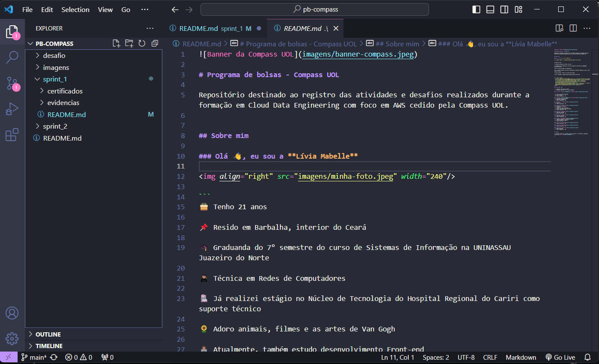
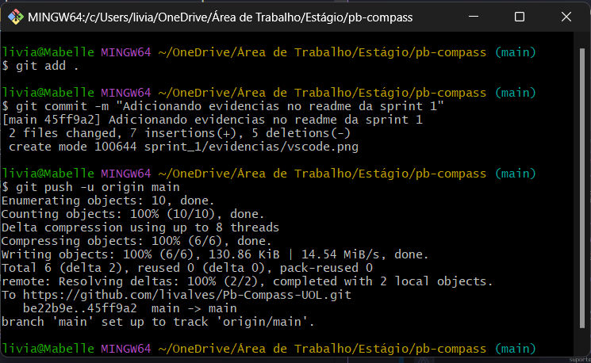
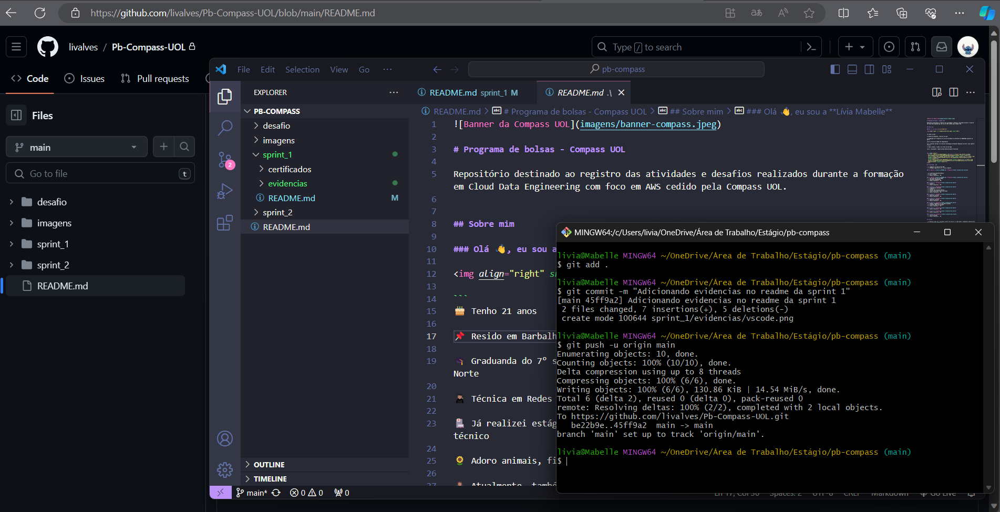
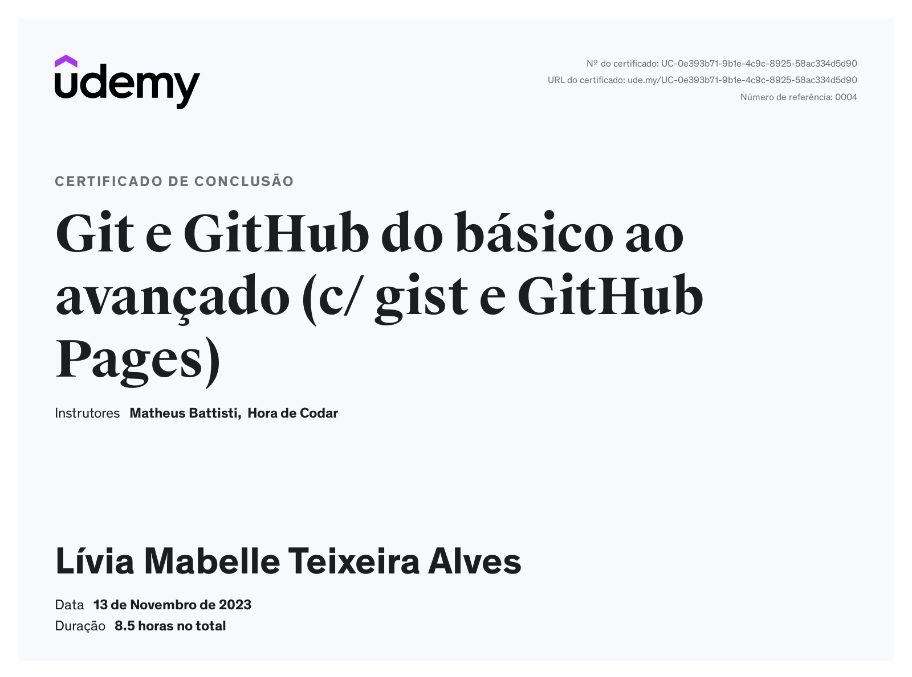
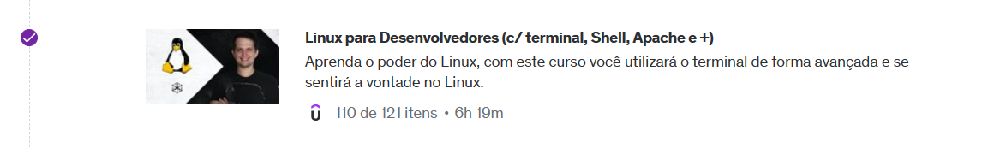
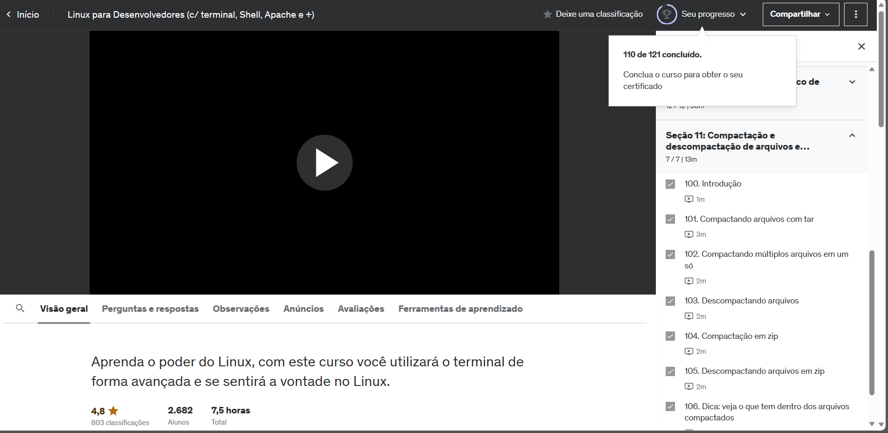

# Sprint 1

> A sprint foi realizada de 06 a 20 de novembro de 2023 com o objetivo de aprender ainda mais sobre a utilização de comandos do sistema Linux, Git e Github. 

## Exercícios  

Cursos realizados durante a Sprint:
- Linux para Desenvolvedores (c/ terminal, Shell, Apache e +)
- Git e GitHub do básico ao avançado (c/ gist e GitHub Pages)

Logo após, para a finalização do exercício desta sprint foi criado o [repositório](https://github.com/livalves/Pb-Compass-UOL) e o editor de texto escolhido foi o _Visual Studio Code_.

## Evidências

> Criação e desenvolvimento do README.md   

> Realizando commit e push

> 

## Certificados

- Git e GitHub do básico ao avançado (Finalizado por completo)

- Linux para Desenvolvedores (Finalizado pela trilha)

