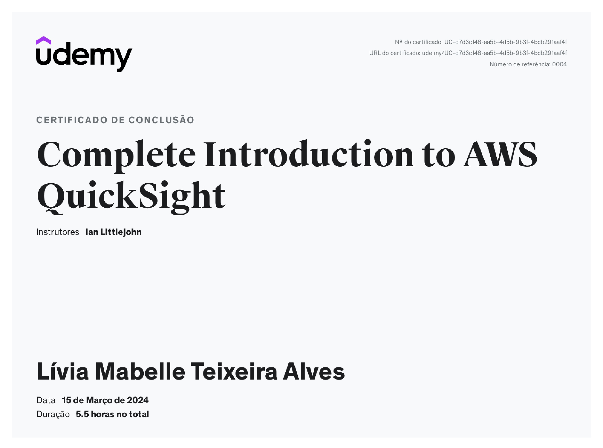

# Sprint 10

> A sprint foi realizada de 11 a 22 de março de 2024 com o objetivo de aprender mais sobre a organização dos dados, transformando-os em informação e conhecimento. Nesse último momento, o desafio foi finalizado e o dashboard foi apresentado.

## Exercícios  

Curso realizado durante a Sprint:
- Complete Introduction to AWS QuickSight

Para a realização da atividade foi utilizado o Console AWS.

#### 1. [Desafio](../desafio/README.md)

## Evidências

> Utilizando o serviço AWS QuickSight.

## Certificados

- AWS QuickSight

