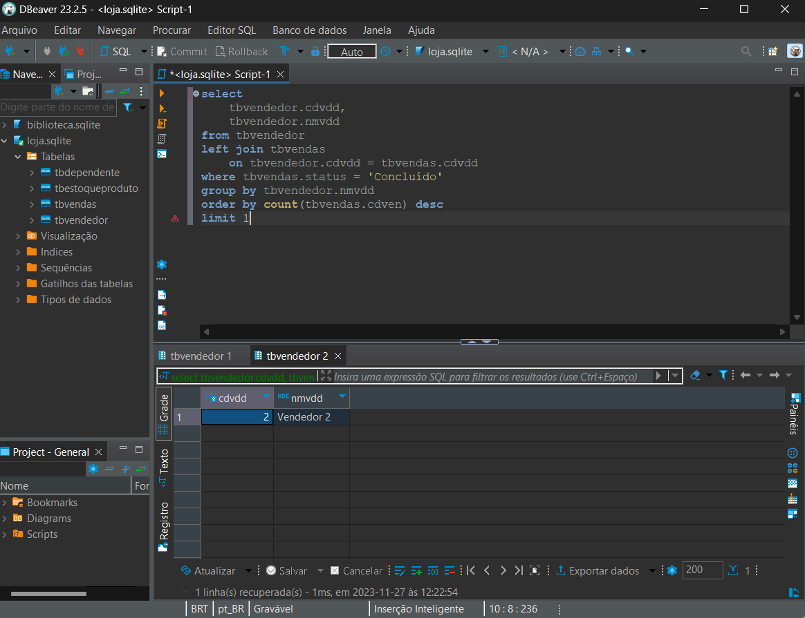
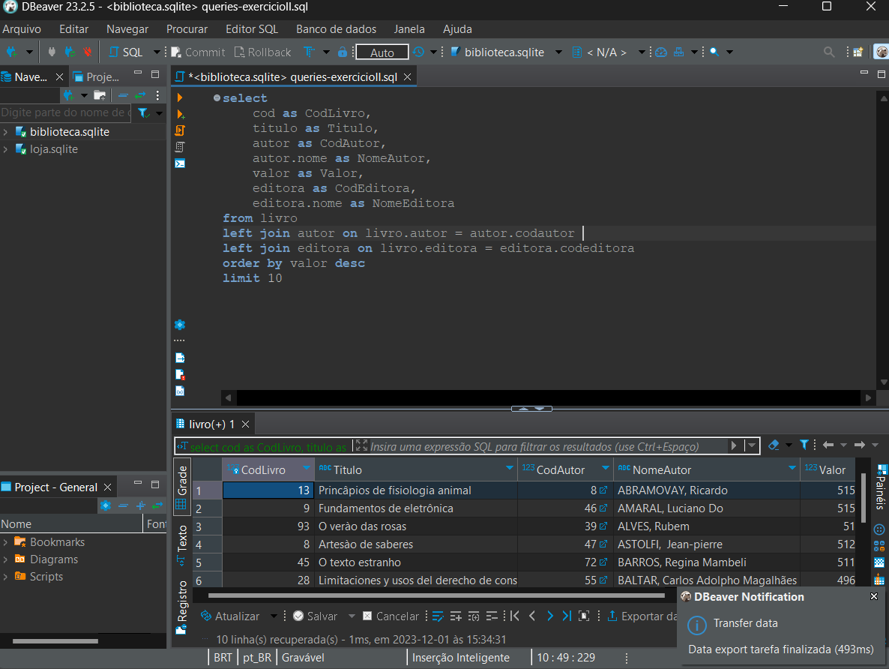
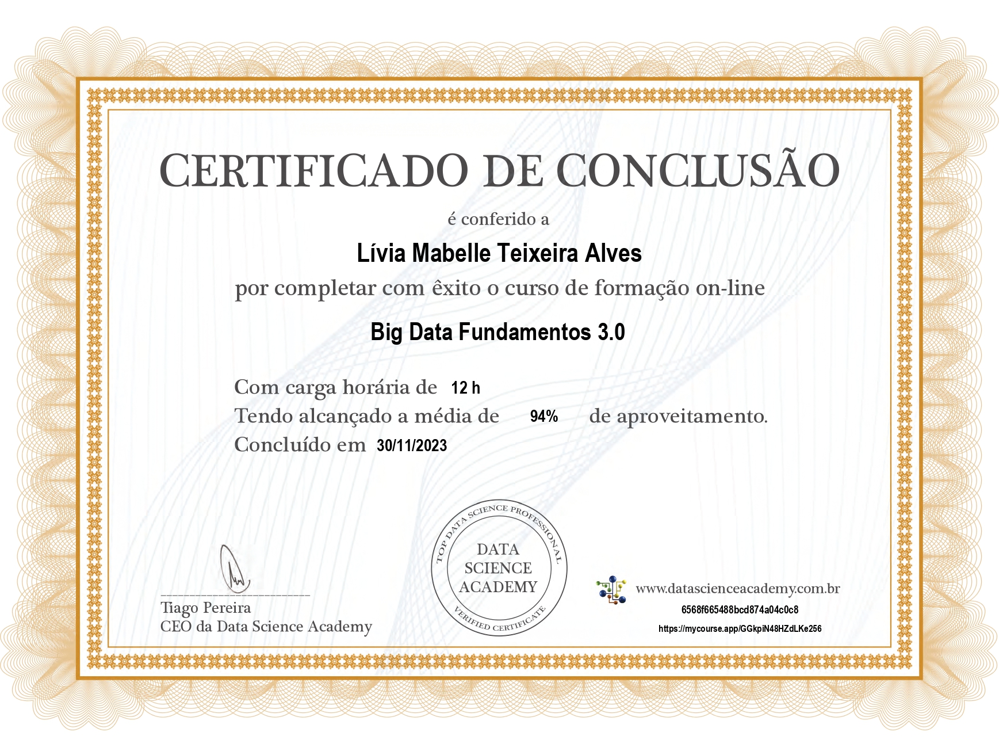

# Sprint 2

> A sprint foi realizada de 20 de novembro a 04 de dezembro de 2023 com o objetivo de aprender ainda mais sobre a utilização de comandos SQL e Big Data. 

## Exercícios  

Cursos realizados durante a Sprint:
- SQL para Análise de Dados: Do básico ao avançado
- Big Data Fundamentos 3.0

Para a realização das seguintes atividades foi escolhido o cliente _DBeaver_.

#### 1. [Exercício Biblioteca](queries/queries-biblioteca.sql)

#### 2. [Exercício Loja](queries/queries-loja.sql)

Diante do segundo exercício proposto, foi realizado a exportação dos dados em arquivos no formato CSV com os delimitadores indicados, sendo gerado os seguintes arquivos:

 [Arquivo CSV - 1](csv/atividade-1.csv)

- Query dos 10 livros mais caros, separador _; (ponto e vírgula)_

 [Arquivo CSV - 2](csv/atividade-2.csv)

- Query das 5 editoras com maior quantidade de livros na biblioteca, separador _| (pipe)_ 

 [Queries](queries/queries-exercicioII.sql)

- Queries desenvolvidas para a extração dos dados da atividade

## Evidências

> Demonstração de query criada e teste realizado.

> Exportando dados para arquivo CSV.

## Certificados

- SQL para Análise de Dados

- Big Data Fundamentos

