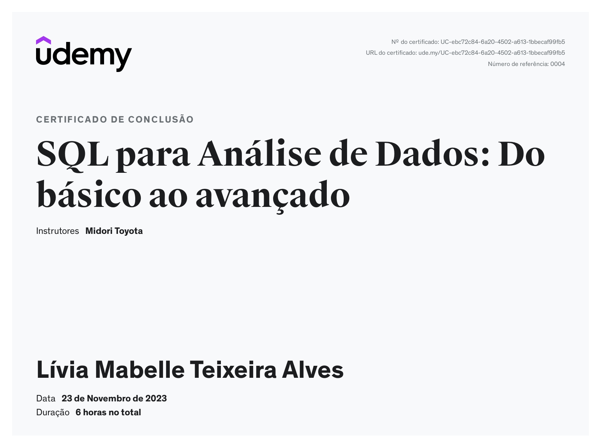

# Sprint 2

> A sprint foi realizada de 20 de novembro a 04 de dezembro de 2023 com o objetivo de aprender ainda mais sobre a utilização de comandos SQL e Big Data. 

## Exercícios  

Cursos realizados durante a Sprint:
- SQL para Análise de Dados: Do básico ao avançado
- Big Data Fundamentos 3.0

### Exercicio Biblioteca

## Evidências

> Utilizando o DBeaver 

## Certificados

- SQL para Análise de Dados

- Big Data Fundamentos

