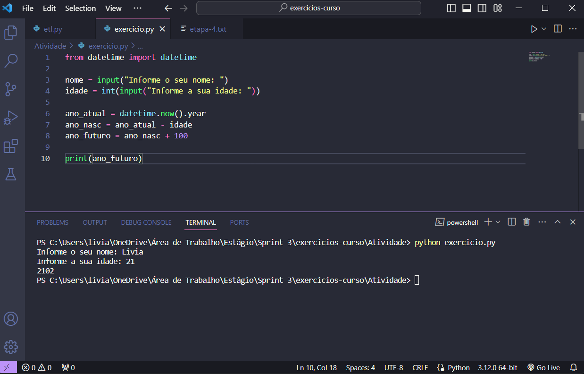

# Sprint 3

> A sprint foi realizada de 4 a 18 de dezembro de 2023 com o objetivo de aprender sobre a linguagem de programação Python, praticando a resolução de exercícios e desenvolvendo ETL.

## Exercícios  

Curso realizado durante a Sprint:
- Python 3 - Curso Completo do Básico ao Avançado

Para a realização das seguintes atividades foi utilizado o VScode.

#### 1. [Exercício I - 1/2](exercicios/exercicio1.py)

#### 2. [Exercício I - 2/2](exercicios/exercicio2.py)

#### 3. [Exercício II](exercicios/exercicio3.py)

#### 4. [Desafio ETL](exercicios/desafio/README.md)

## Evidências

> Desenvolvendo e testando o código.

## Certificados

- Python 3 (Finalizado pela trilha)

