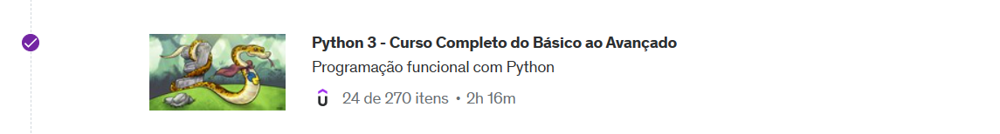
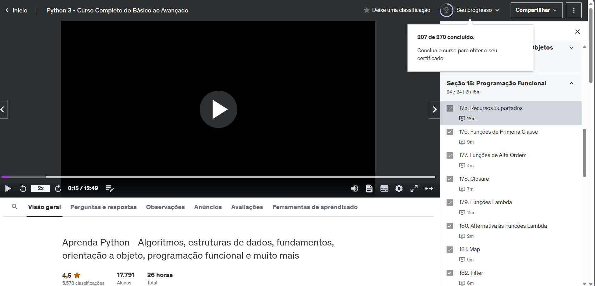
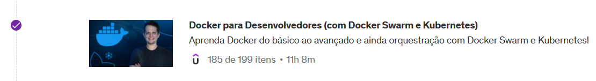
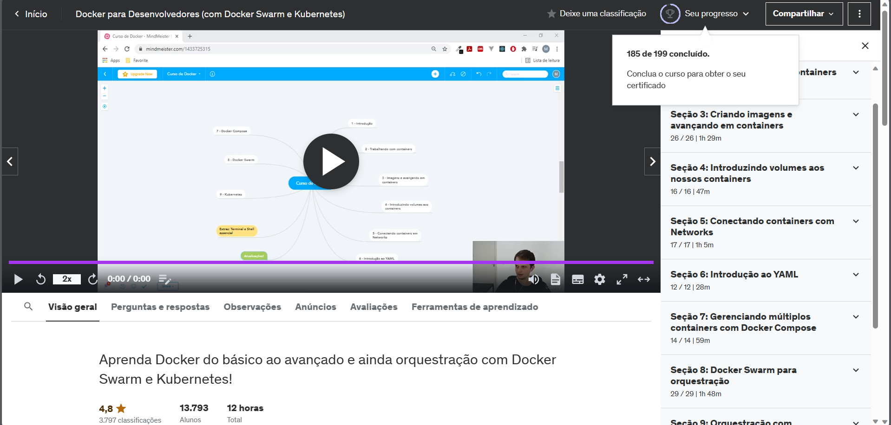
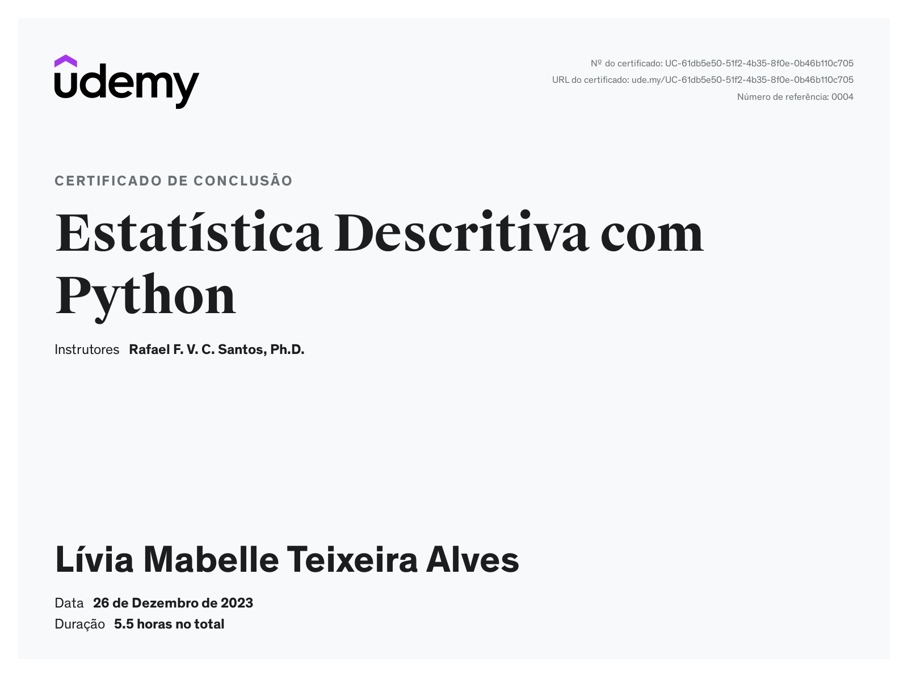

# Sprint 4

> A sprint foi realizada de 18 a 29 de dezembro de 2023 com o objetivo de aprender sobre a linguagem de programação Python, focada na programação funcional, estatística descritiva e na utilização do Docker.

## Exercícios  

Cursos realizados durante a Sprint:
- Python 3 - Curso Completo do Básico ao Avançado
- Docker para Desenvolvedores (com Docker Swarm e Kubernetes)
- Estatística Descritiva com Python

Para a realização das seguintes atividades foi utilizado o VScode.

#### 1. [Exercícios de programação](exercicios/)

#### 2. [Exercício - Container com Docker](exercicios/)

## Evidências

> Desenvolvendo e testando código.

> Criando uma imagem.

## Certificados

- Python 3 (Finalizado pela trilha)

- Docker (Finalizado pela trilha)

- Estatística Descritiva 

