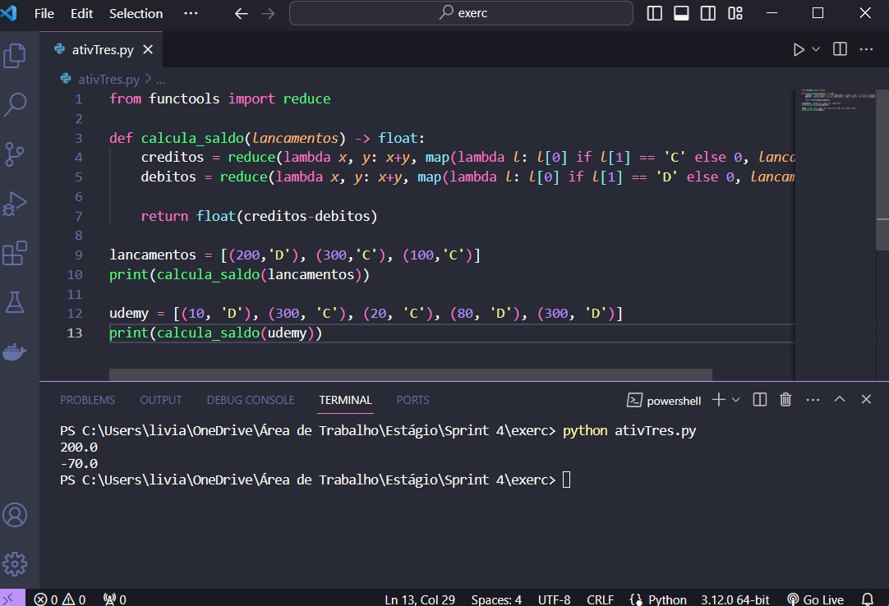
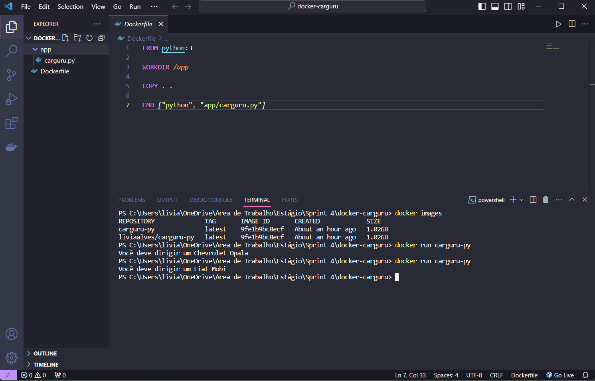

# Sprint 4

> A sprint foi realizada de 18 de dezembro a 01 de janeiro de 2024 com o objetivo de aprender sobre a linguagem de programação Python, focada na programação funcional, estatística descritiva e na utilização do Docker.

## Exercícios  

Cursos realizados durante a Sprint:
- Python 3 - Curso Completo do Básico ao Avançado
- Docker para Desenvolvedores (com Docker Swarm e Kubernetes)
- Estatística Descritiva com Python

Para a realização das seguintes atividades foi utilizado o VScode e o Docker.

#### 1. [Exercícios de programação](exercicios/python/exercicios.py)

#### 2. [Exercício - Container com Docker](exercicios/docker/README.md)

## Evidências

> Desenvolvendo e testando código.

> Verificando imagens e rodando container.

## Certificados

- Python 3 (Finalizado pela trilha)

- Docker (Finalizado pela trilha)

- Estatística Descritiva 

