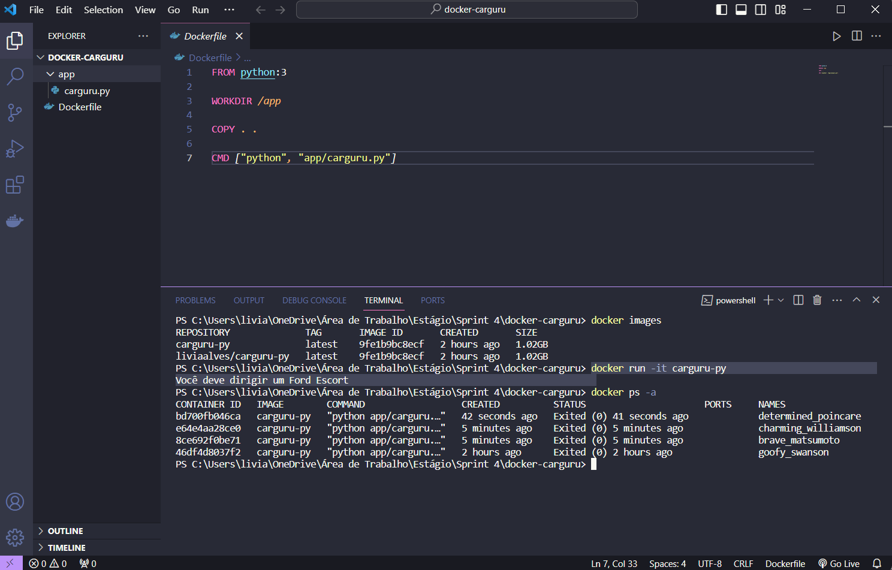
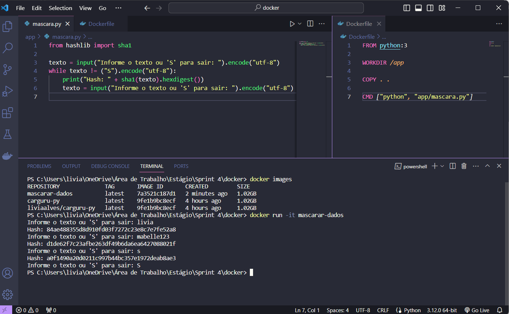

## Containers com Docker

1- Construa uma imagem a partir de um arquivo de instruções (Dockerfile) que execute o código [carguru.py](docker-carguru/app/carguru.py). Após, execute um container a partir da imagem criada.

- Conteúdo do arquivo: [Dockerfile](docker-carguru/Dockerfile)

- A imagem foi chamada de "carguru-py" e criada utilizando o comando:

    `docker build -t carguru-py . `
 
- Com o comando abaixo é possível executar o container:

	`docker run -it carguru-py`

> Executando o container:

- 📍Imagem disponibilizada no Docker Hub: [Carguru-py](https://hub.docker.com/r/liviaalves/carguru-py)

----

2- É possível reutilizar containers? 

Sim, é possível iniciar e reutilizar um container parado utilizando o comando:

`docker start <id ou nome do container>`

----

3- Agora vamos exercitar a criação de um container que permita receber inputs durante sua execução. Seguem as instruções.

- Criar novo script Python que implementa o algoritmo a seguir:
    - 1: Receber uma string via input
    - 2: Gerar o hash  da string por meio do algoritmo SHA-1
    - 3: Imprimir o hash em tela, utilizando o método hexdigest
    - 4: Retornar ao passo 1

- Conteúdo do script python: [mascara.py](docker-mascara/app/mascara.py)

- Conteúdo do arquivo: [Dockerfile](docker-mascara/Dockerfile)

- A imagem foi chamada de "mascarar-dados" e criada para executar o script python utilizando o comando:

    `docker build -t mascarar-dados . `

- Com o comando abaixo é possível iniciar o container:

	`docker run -it mascarar-dados`

> Enviando algumas palavras para mascaramento:

- 📍Imagem disponibilizada no Docker Hub: [Mascarar-dados](https://hub.docker.com/r/liviaalves/mascarar-dados)