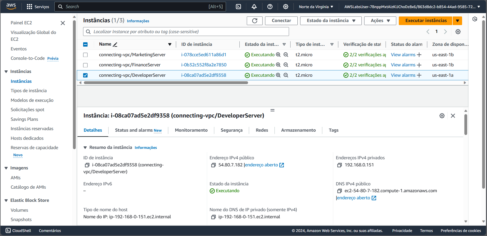
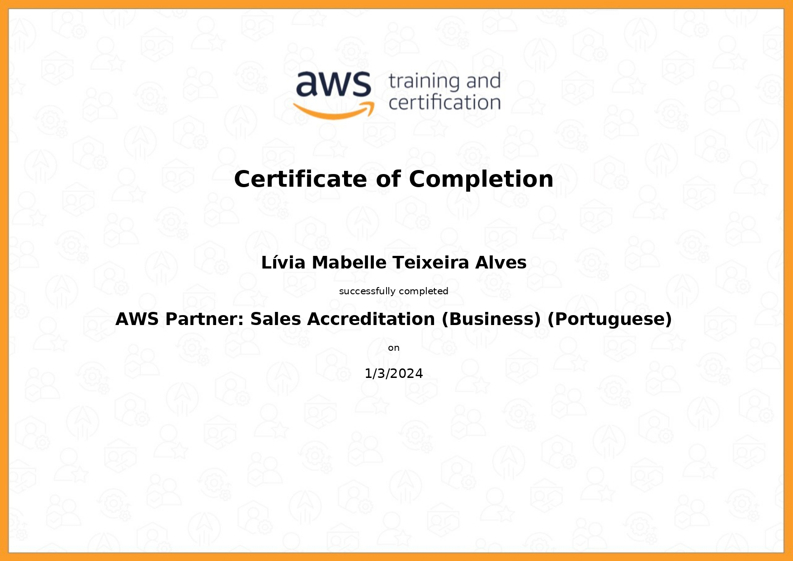
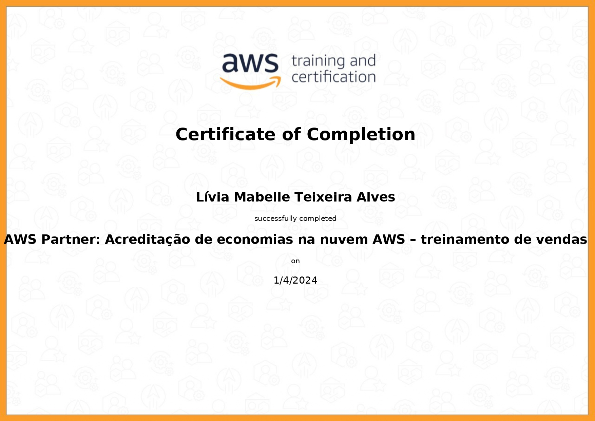
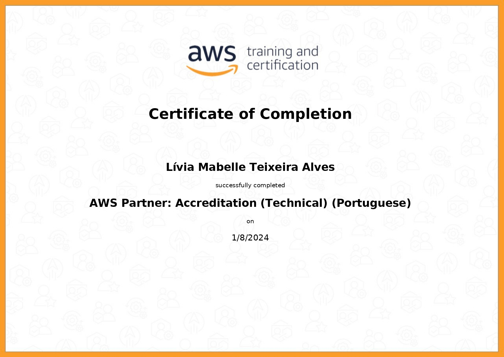
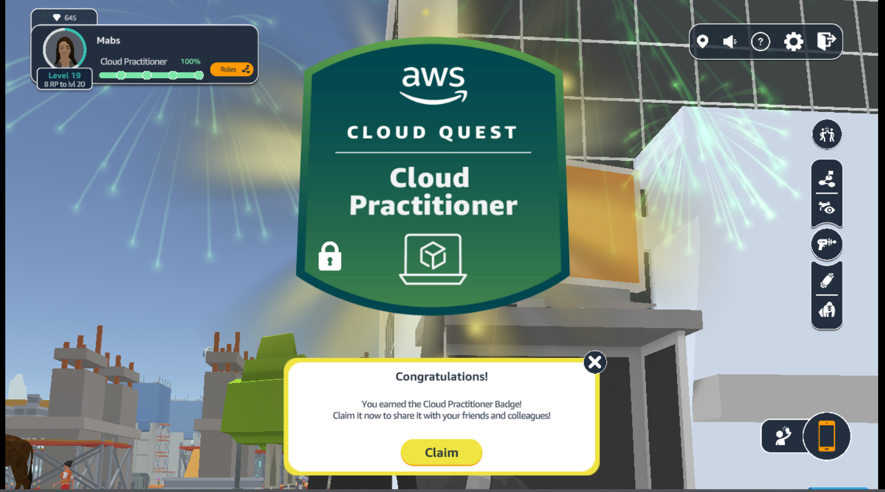

# Sprint 5

> A sprint foi realizada de 1 a 15 de janeiro de 2024 com o objetivo de aprender sobre computação em nuvem, com foco na utilização e nos serviços da AWS.

## Exercícios  

Cursos realizados durante a Sprint:
- AWS Partner: Sales Accreditation (Business)
- AWS Partner: Cloud Economics Accreditation
- AWS Partner: Accreditation
- AWS Cloud Quest: Cloud Practitioner
- Exam Prep: AWS Certified Cloud Practitioner

## Evidências

> Utilizando o console AWS para concluir a missão sobre VPC.

## Certificados

- Sales Accreditation

- Cloud Economics Accreditation

- Accreditation

- AWS Cloud Quest

- Exam Prep

