# Sprint 6

> A sprint foi realizada de 15 a 29 de janeiro de 2024 com o objetivo de aprender sobre os serviços AWS, sua utilização para a análise de dados e a realização de laboratorios de configuração de determinados serviços.

## Exercícios  

Cursos realizados durante a Sprint:
- Data Analytics Fundamentals (Portuguese)
- Data Analytics on AWS (Business) (Portuguese)
- AWS Skill Builder - Introduction to Amazon Kinesis Streams
- AWS Skill Builder - Introduction to Amazon Kinesis Analytics
- AWS Skill Builder - Introduction to Amazon Elastic MapReduce (EMR) (Portuguese)
- AWS Skill Builder - Introduction to Amazon Athena (Portuguese)
- AWS Skill Builder - Introduction to Amazon Quicksight (Portuguese)
- AWS Skill Builder - Introduction to AWS IoT Analytics
- AWS Skill Builder - Getting Started with Amazon Redshift
- AWS Skill Builder - Deep Dive into Concepts and Tools for Analyzing Streaming Data (Portuguese)
- AWS Skill Builder - Best Practices for Data Warehousing with Amazon Redshift (Portuguese)
- AWS Skill Builder - Serverless Analytics (Portuguese) 
- AWS Skill Builder -  Why Analytics for Games (Portuguese)

Para a realização dos seguintes laboratórios foi utilizado o VScode, o Docker e o Console AWS.

#### 1. [Lab AWS S3](exercicios/s3/README.md)

#### 2. [Lab AWS Athena](exercicios/athena/README.md)

#### 3. [Lab AWS Lambda](exercicios/lambda/README.md)

#### 4. [Lab AWS - Limpeza de recursos](exercicios/limpeza/README.md)

## Evidências

> Utilizando o console AWS no serviço Athena.
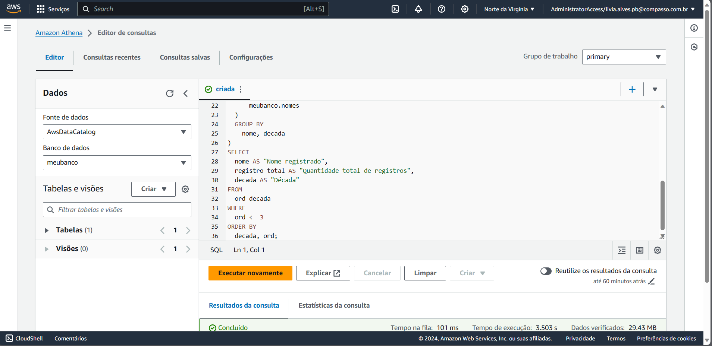

## Certificados

- Data Analytics Fundamentals

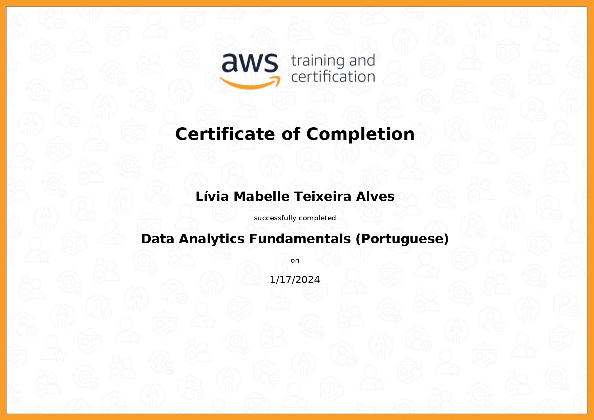

- Data Analytics on AWS (Business)

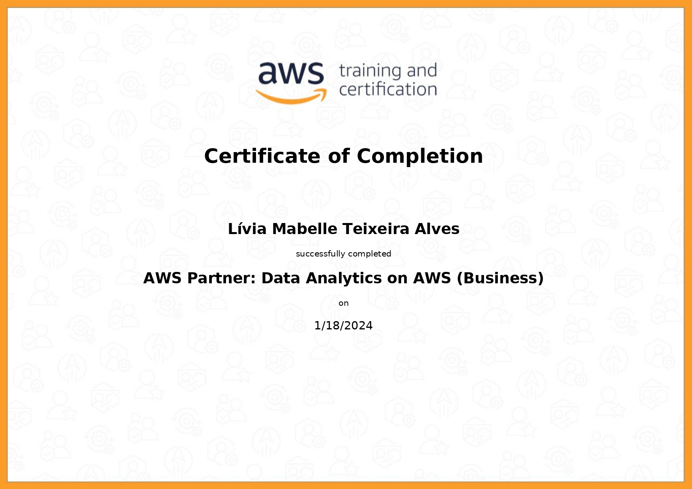

- Introduction to Amazon Kinesis Streams

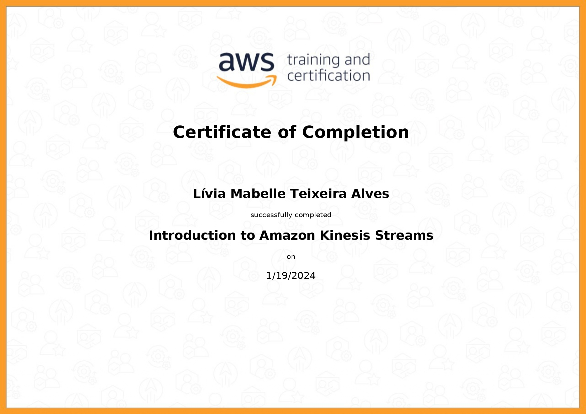

- Introduction to Amazon Kinesis Analytics

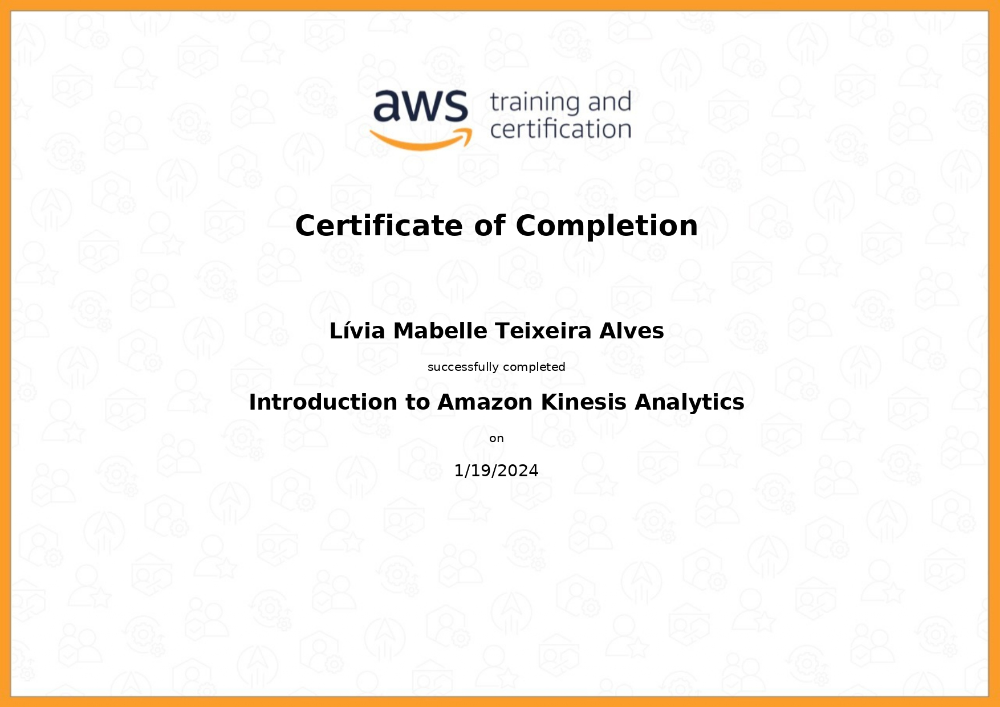

- Introduction to Amazon Elastic MapReduce (EMR)

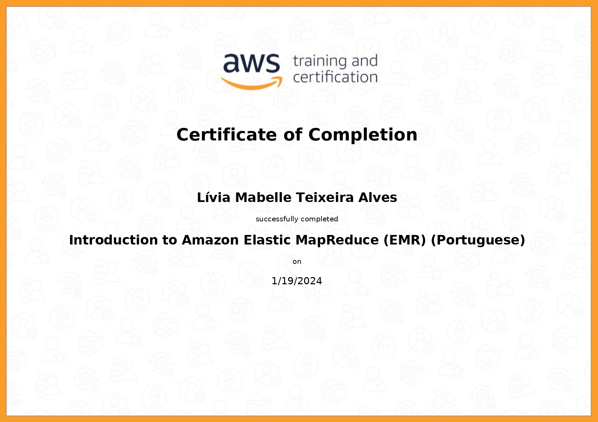

- Introduction to Amazon Athena

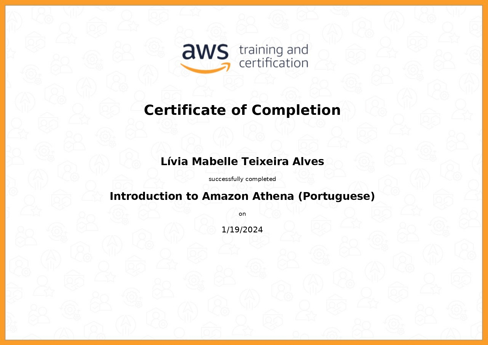

- Introduction to Amazon Quicksight

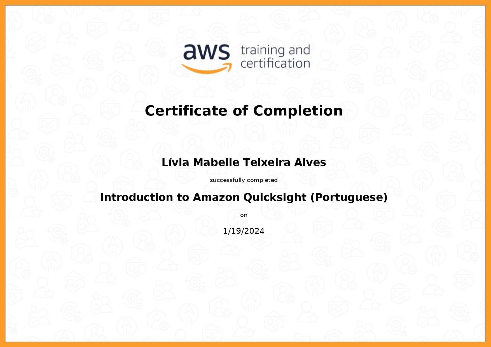

- Introduction to AWS IoT Analytics

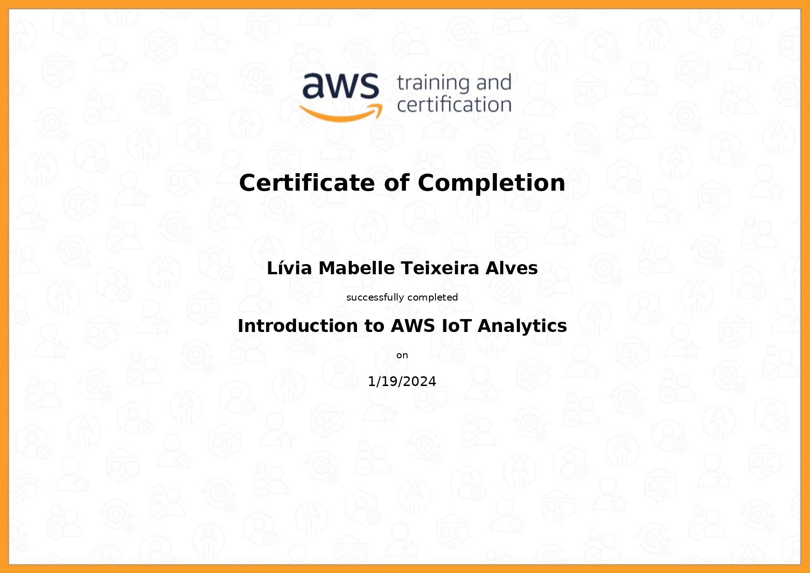

- Getting Started with Amazon Redshift

- Deep Dive into Concepts and Tools for Analyzing Streaming Data

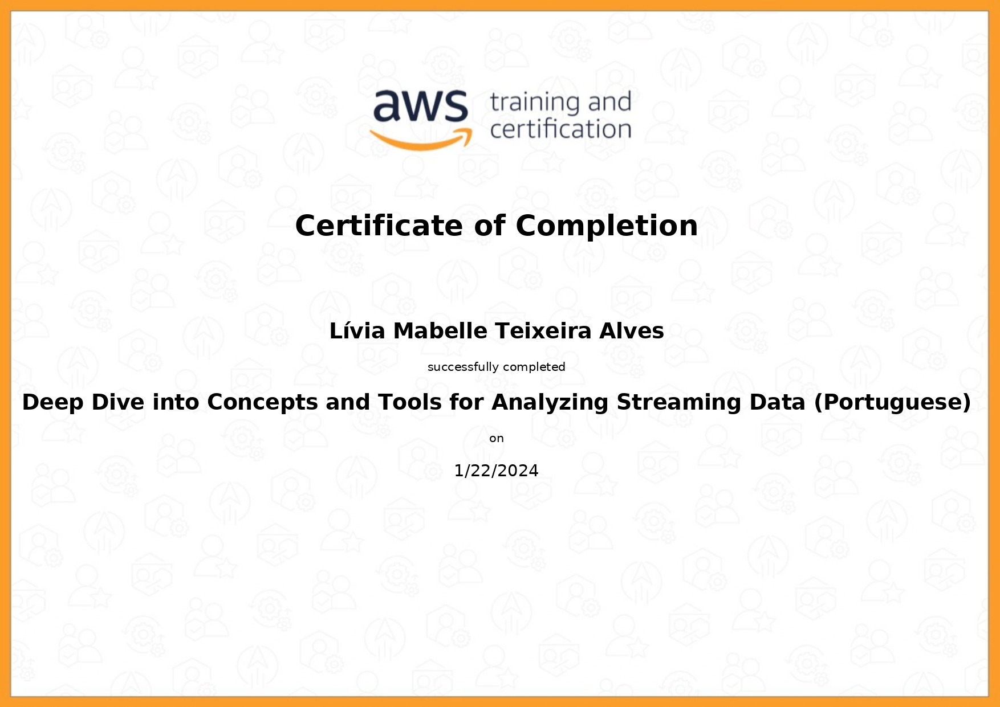

- Best Practices for Data Warehousing with Amazon Redshift

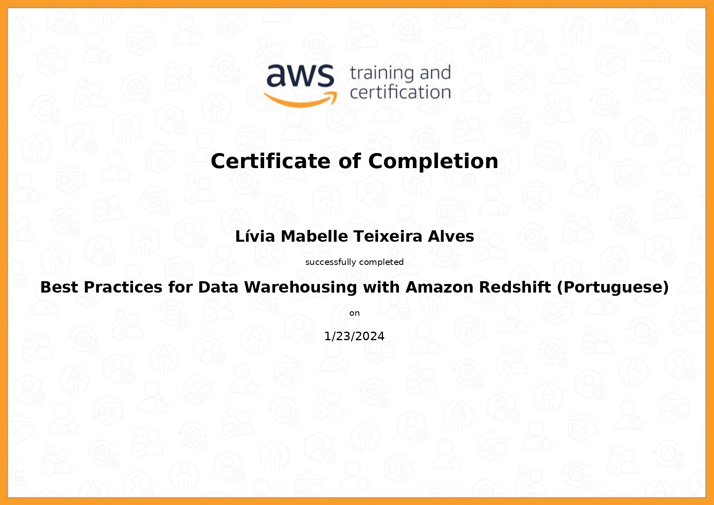

- Serverless Analytics 

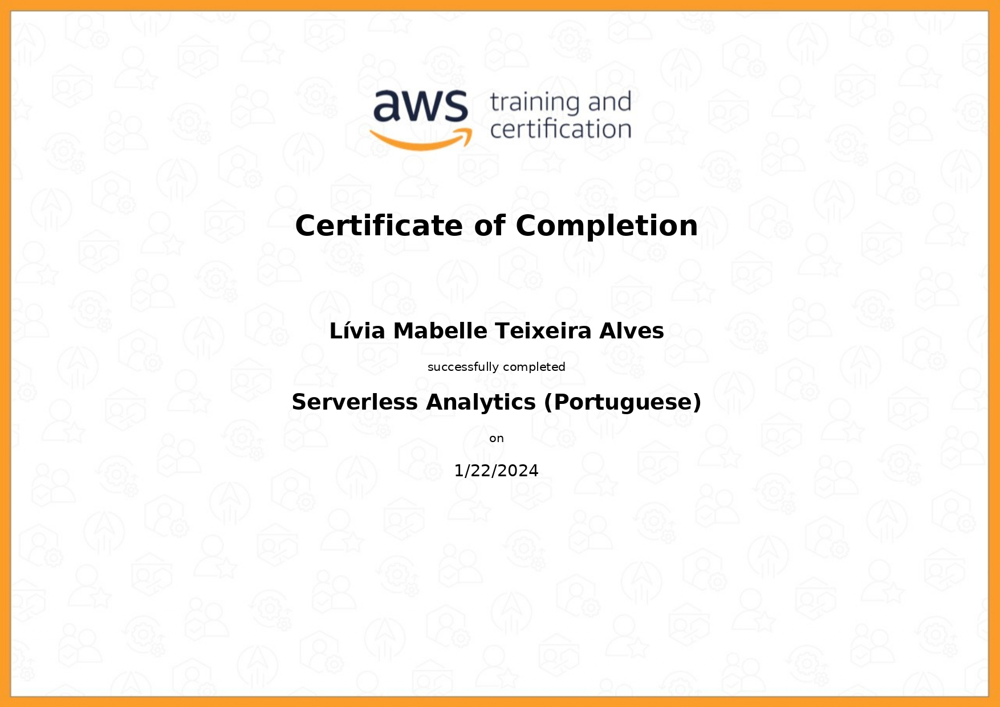

- Why Analytics for Games 

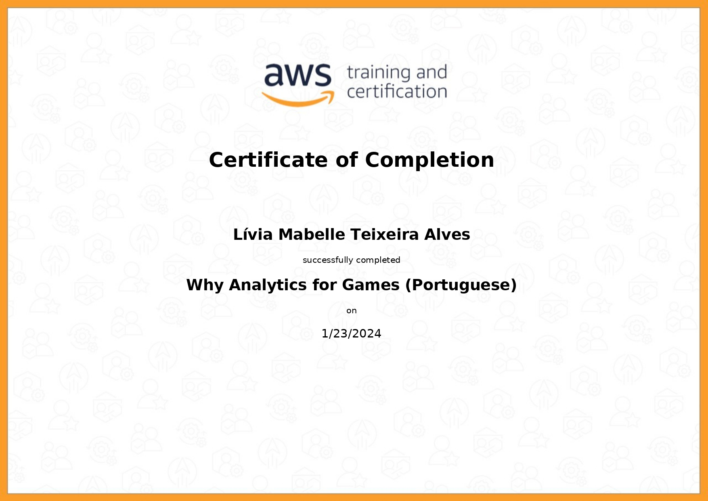

