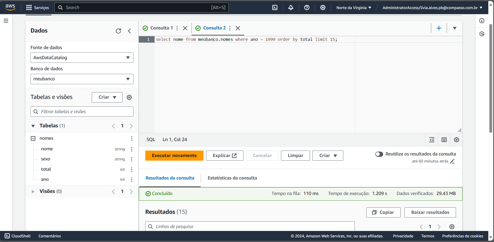

# Lab AWS Athena

- Criação de um banco de dados no serviço AWS Athena e realização de consultas.

1. Criação de uma pasta chamada "queries" no bucket do S3 já criado no lab anterior (site-static-bucket) 


2. Configuração deste destino no AWS Athena para salvamento das futuras consultas


3. Criação da tabela utilizando os dados já disponíveis no arquivo nomes.csv armazenado anteriormente no bucket do S3


4. Realizando a consulta com a query solicitada

`select nome from nomedobanco.nomedatabela where ano = 1999 order by total limit 15;`




5. Realizando consulta a partir da query criada buscando listar os 3 nomes mais usados em cada década desde o 1950 até hoje


#

#### Código - Query 

- Crie uma consulta que lista os 3 nomes mais usados em cada década desde o 1950 até hoje.

```sql
WITH ord_decada AS (
  SELECT 
    nome,
    SUM(total) AS registro_total,
    decada,
    ROW_NUMBER() OVER (PARTITION BY decada ORDER BY SUM(total) DESC) AS ord
  FROM (
    SELECT
      nome,
      total,
      CASE 
        WHEN ano BETWEEN 1950 AND 1959 THEN '1950'
        WHEN ano BETWEEN 1960 AND 1969 THEN '1960'
        WHEN ano BETWEEN 1970 AND 1979 THEN '1970'
        WHEN ano BETWEEN 1980 AND 1989 THEN '1980'
        WHEN ano BETWEEN 1990 AND 1999 THEN '1990'
        WHEN ano BETWEEN 2000 AND 2009 THEN '2000'
        WHEN ano BETWEEN 2010 AND 2019 THEN '2010'
        ELSE '2020'
      END AS decada
    FROM
      meubanco.nomes
  )
  GROUP BY
    nome, decada
)
SELECT 
  nome AS "Nome registrado",
  registro_total AS "Quantidade total de registros",
  decada AS "Década"
FROM 
  ord_decada
WHERE 
  ord <= 3
ORDER BY 
  decada, ord;
```