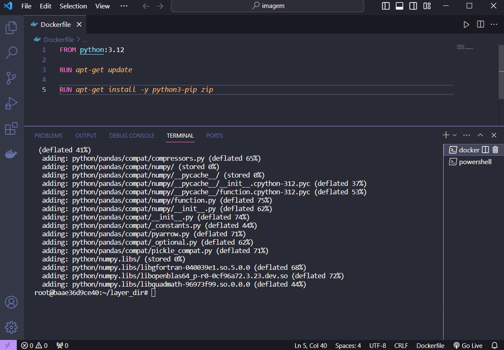

# Lab AWS Lambda

- Criação de uma função lambda e de uma camada com o auxílio da imagem Docker.

1. Criando a função pelo console aws

2. Atualizando o código lambda_function.py

3. Realizando o teste para verificação do erro esperado

4. Criando imagem docker para implementação da camada com adaptação para suporte do python 3.12

5. Configurando pastas a partir do prompt

6. Compactando os arquivos criados

7. Copiando o arquivo compactado para a máquina local 

8. Criando um novo bucket para armazenamento do arquivo compactado

9. Criando camada com a nova imagem 

10. Adicionando camada a função lambda

11. Atualizando consulta com o nome do bucket criado no lab S3 que armazena o arquivo nomes.csv

12. Função finalizada e funcionando 

