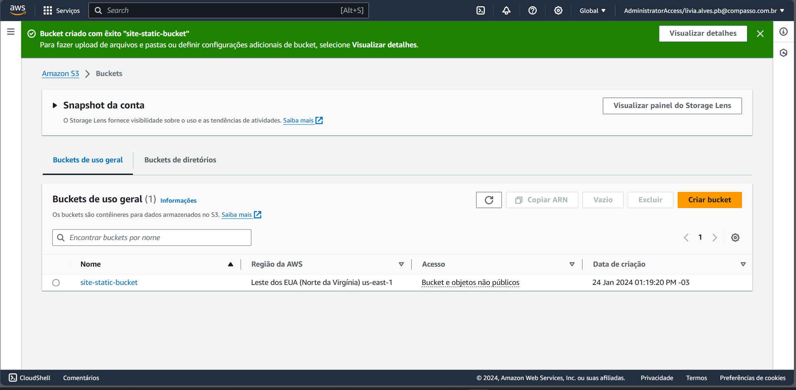
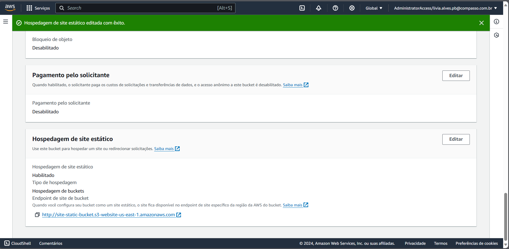
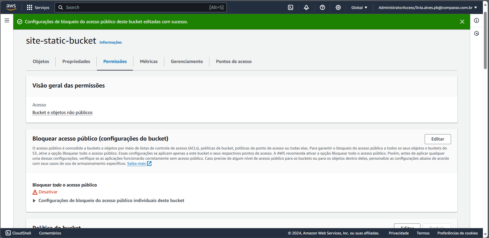
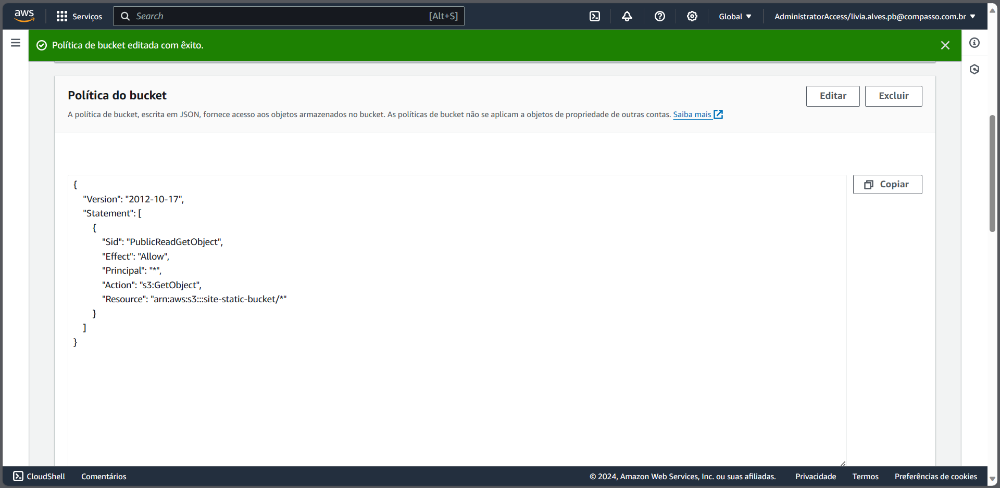
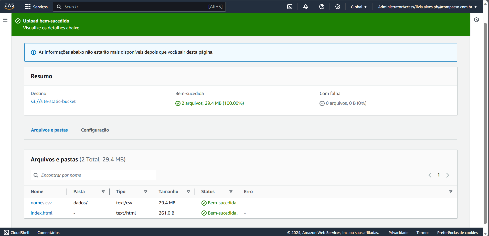
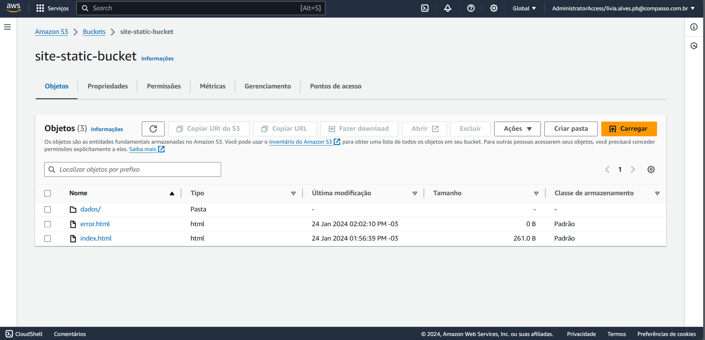
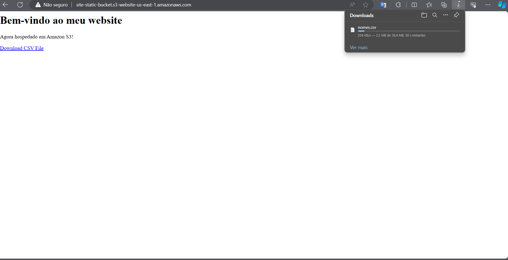

# Lab AWS S3

- Criação de um bucket do Amazon S3 que funcione como hospedagem de conteúdo estático.

1. Criando o bucket no S3

2. Configurando para hospedagem e atribuindo o index e o arquivo de erro

3. Realizando alterações para que o bucket possa ter acesso público

4. Para acesso, foi configurado as políticas do bucket para torná-lo disponível 

5. Adicionando os arquivos necessários para o site, foi adicionado o arquivo csv na pasta dados e o arquivo index.html

6. Adicionando o arquivo de 404.html solicitado, logo nomeado como error.html, nome já escolhido inicialmente nas configurações do bucket

7. Após a realização das etapas, o site está funcionando através do acesso ao endpoint 

