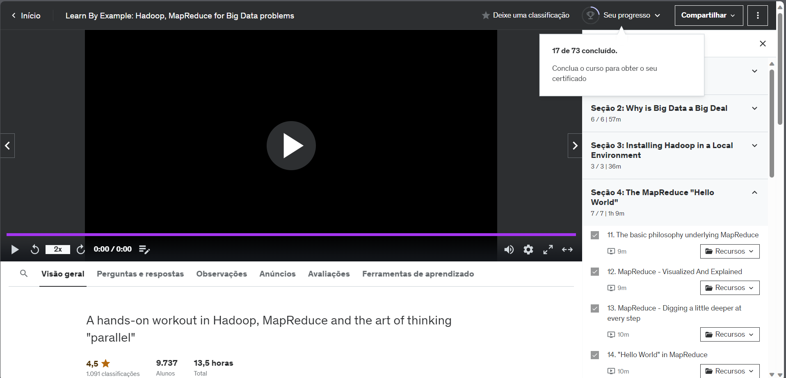
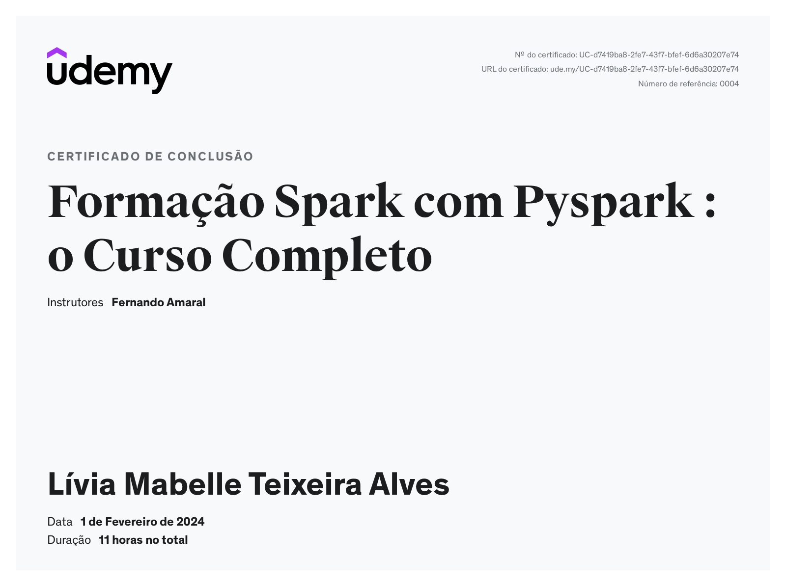

# Sprint 7

> A sprint foi realizada de 29 de janeiro a 14 de fevereiro de 2024 com o objetivo de aprender sobre o universo Spark e Hadoop.

## Exercícios  

Cursos realizados durante a Sprint:
- Learn By Example: Hadoop, MapReduce for Big Data problems
- Formação Spark com Pyspark: o Curso Completo

Para a realização dos seguintes laboratórios foi utilizado o VScode, o Docker e o Console AWS.

#### 1. [Exercício - Python com Pandas](exercicios/python//README.md)

#### 2. [Exercício - Apache Spark](exercicios/apache/)

#### 3. [Lab AWS Glue](exercicios/glue/)

#### 4. [Desafio](../desafio/README.md)

## Evidências

> Rodando código python.

> Utilizando o console AWS no serviço.

## Certificados

- Hadoop, MapReduce for Big Data (Finalizado pela trilha)

- Formação Spark com Pyspark

