## Lab AWS Glue 

- Construindo um processo de ETL simplificado utilizando o serviço AWS Glue.

1. Preparando os dados de origem
- No serviço S3 da AWS foi criado o bucket *sprint-lab* para armazenamento dos dados. 

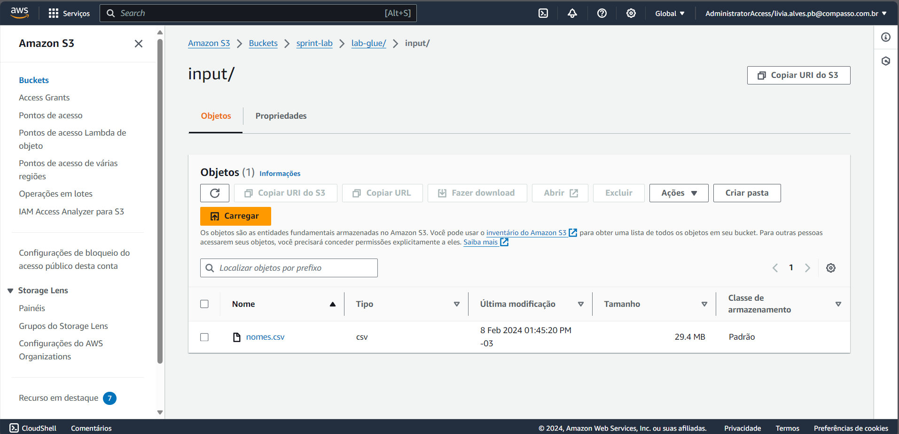

2. Configurando conta para utilizar o AWS Glue
- Foi adicionado o usuário *adm-livia.alves* para acesso ao serviço AWS Glue, assim como, foi configurado o acesso ao S3.

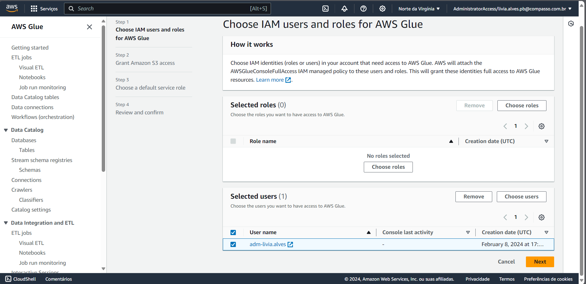
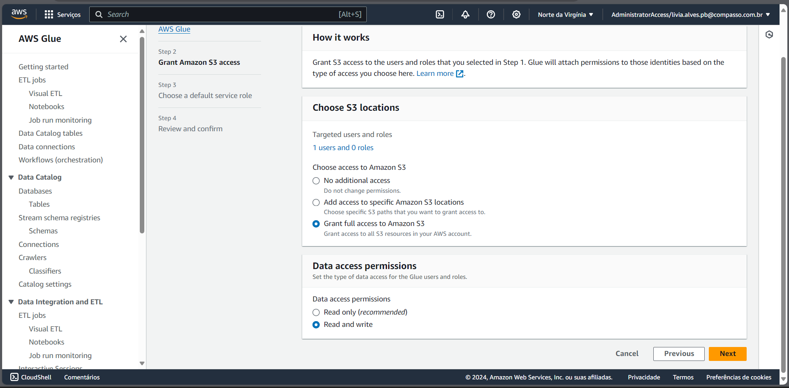

3. Criando IAM Role para os jobs do AWS Glue
- Foi criado a role chamada *AWSGlueServiceRole-Lab4* com as permissões necessárias.

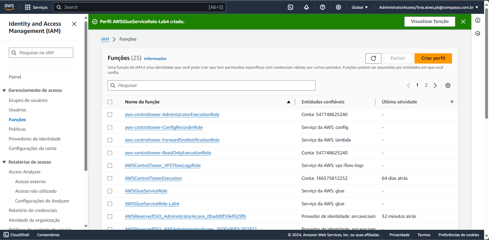
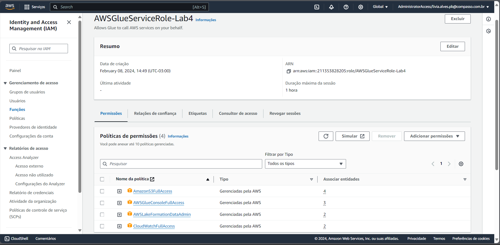

4. Configurando as permissões no AWS LakeFormation
- Foi criado o database chamado *glue-lab*, e logo adicionado o usuário como administrador principal do data lake.

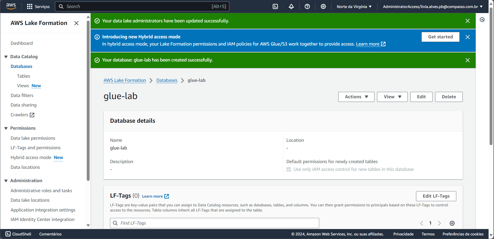
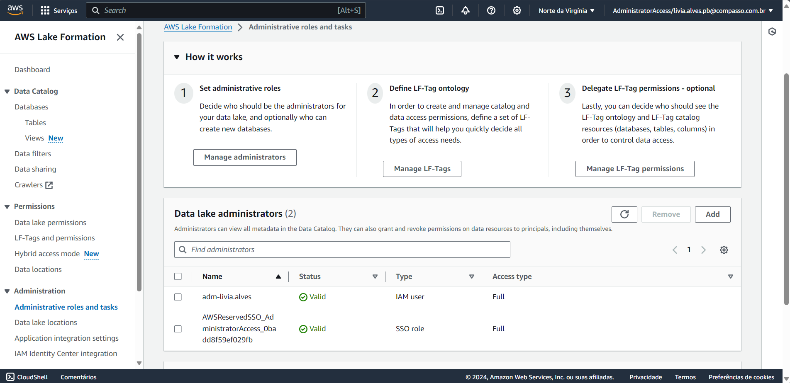

- Em seguida, foi configurado a role de permissões para o database criado.

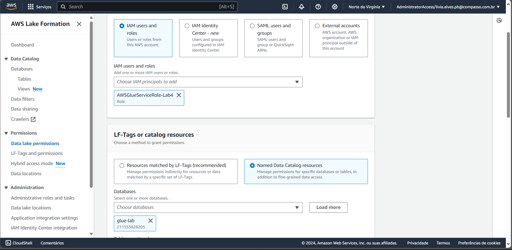
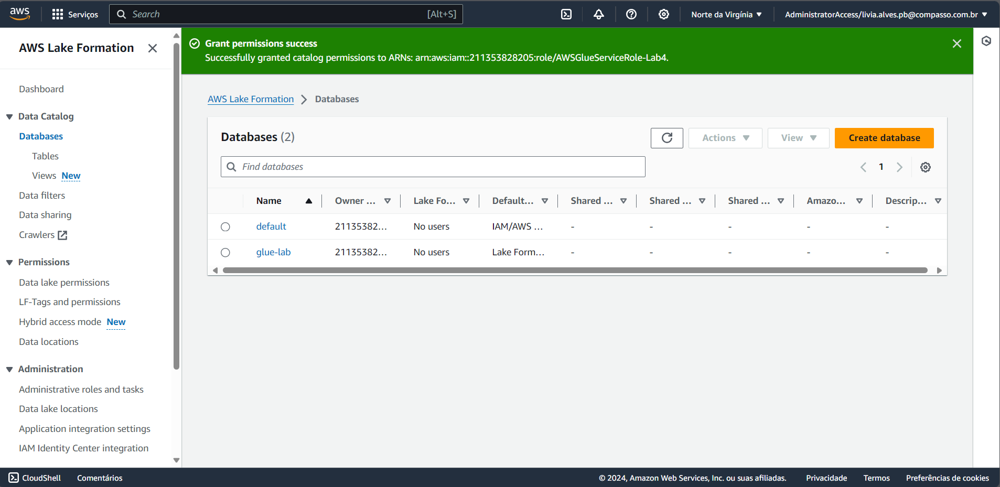

5. Criando novo job no AWS Glue
- Tentativa de criação do job para processamento do arquivo *nomes.csv* com spark, foi iniciado a configuração dos detalhes do job. 

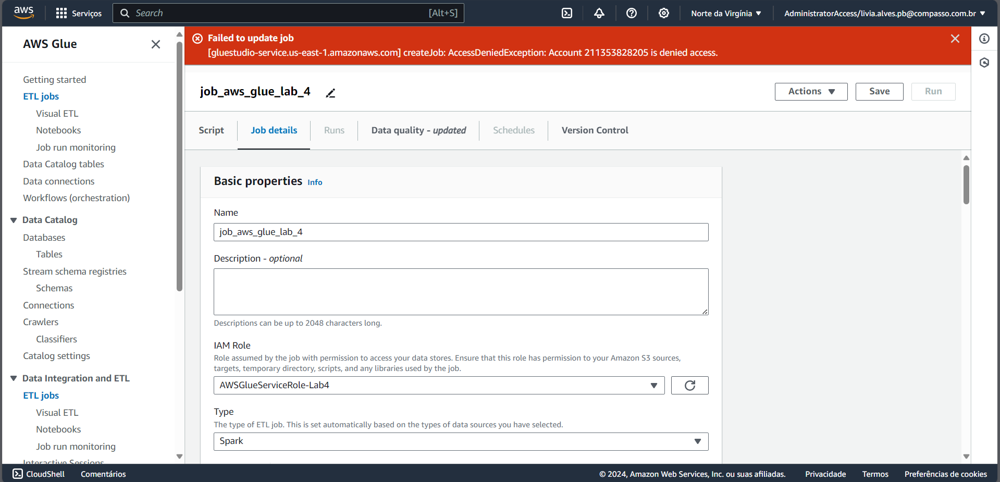

- Em seguida, foi realizado a tentativa de configuração do path para leitura do arquivo csv e armazenamento dos resultados.

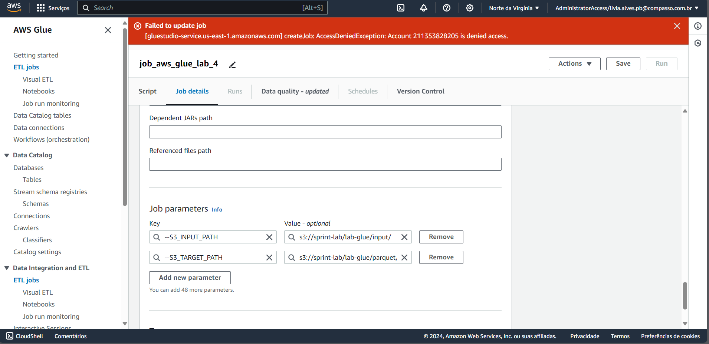
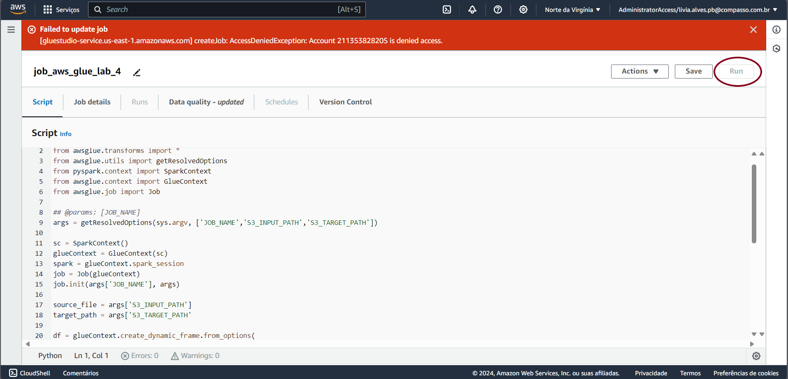

- Sem execuções de jobs devido as permissões.

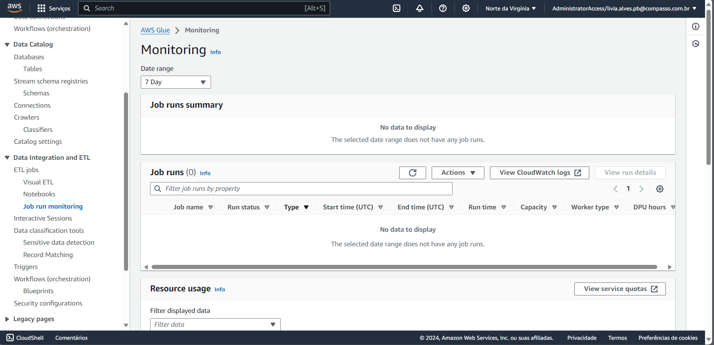

