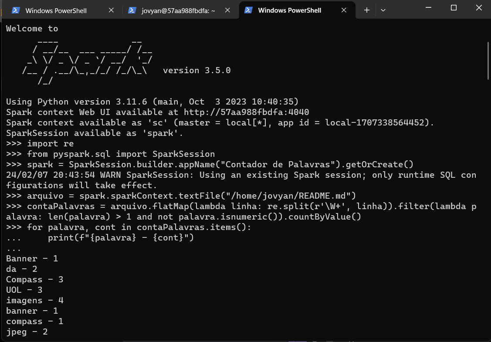

## Apache Spark - Contador de Palavras

- Processando job com framework Spark por meio de um container Docker.

1. Utilização da imagem jupyter/all-spark-notebook para criação de um container.

**Realizando pull da imagem jupyter/all-spark-notebook** pelo comando `docker pull jupyter/all-spark-notebook`


**Criando um container a partir da imagem** utilizando o comando `docker run --name jupyter-exerc -it -p 8888:8888 jupyter/all-spark-notebook`


**Acessando o Jupyter Lab:**


**Executando o comando _pyspark_ no  container** pelo comando `docker exec -it jupyter-exerc pyspark`


2. Contador de Palavras utilizando spark.

Com o comando `docker exec -it jupyter-exerc bash`, foi criado o arquivo para contagem dentro do container


**Código para apresentação da quantidade de ocorrências de cada palavra contida no arquivo README.md.**

- O código considera apenas os caracteres alfanuméricos, desconsidera os espaços vazios, os elementos de individuais (ex: O, a, e) e números. 

```
import re
from pyspark.sql import SparkSession

spark = SparkSession.builder.appName("Contador de Palavras").getOrCreate()

arquivo = spark.sparkContext.textFile("/home/jovyan/README.md")

contaPalavras = arquivo.flatMap(lambda linha: re.split(r'\W+', linha)).filter(lambda palavra: len(palavra) > 1 and not palavra.isnumeric()).countByValue()

for palavra, cont in contaPalavras.items():
    print(f"{palavra} - {cont}")

spark.stop()
```



