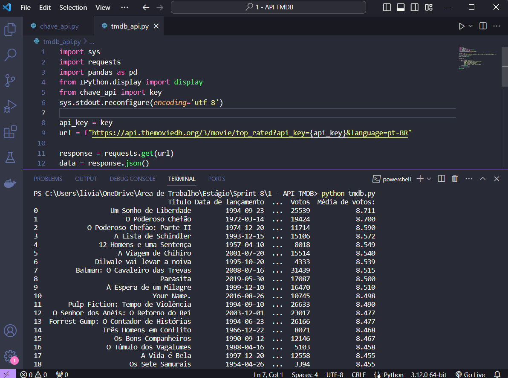
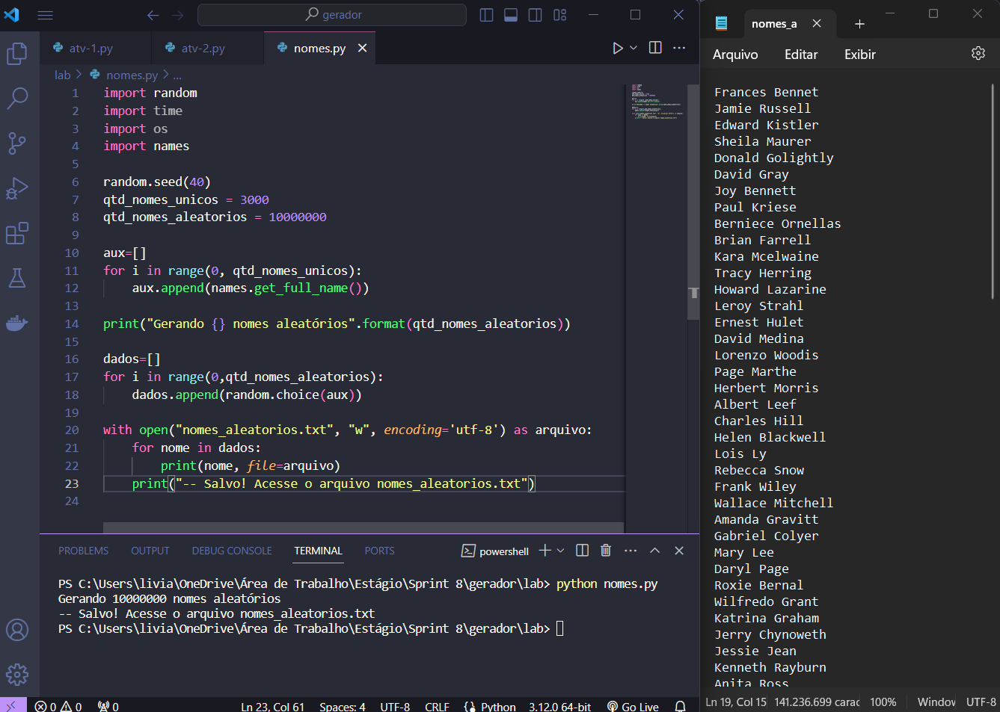
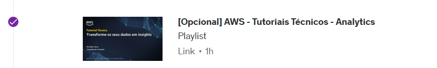
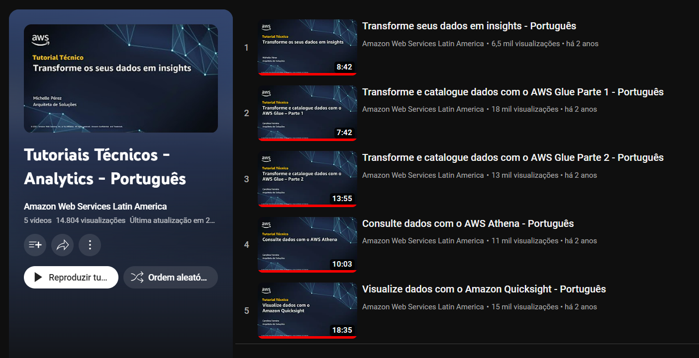

# Sprint 8

> A sprint foi realizada de 15 a -- de fevereiro de 2024 com o objetivo de aprofundar o conhecimento no framework Apache Spark, explorar novos serviços da AWS e avançar no desenvolvimento do projeto final.

## Exercícios  

Tutorial acompanhado durante a Sprint:
- AWS - Tutoriais Técnicos - Analytics

Para a realização dos seguintes laboratórios foi utilizado o VScode e o Console AWS.

#### 1. [Exercício - TMDB](exercicios/api//README.md)

#### 2. [Desafio](../desafio/README.md)

#### 3. [Exercício - Geração de massa de dados](exercicios/python/README.md) 

#### 4. [Exercício - Apache Spark](exercicios/spark/README.md) 

## Evidências

> Extraindo dados da API TMDB.

> Gerando dados em massa com python.

## Certificados

- Tutoriais Técnicos

