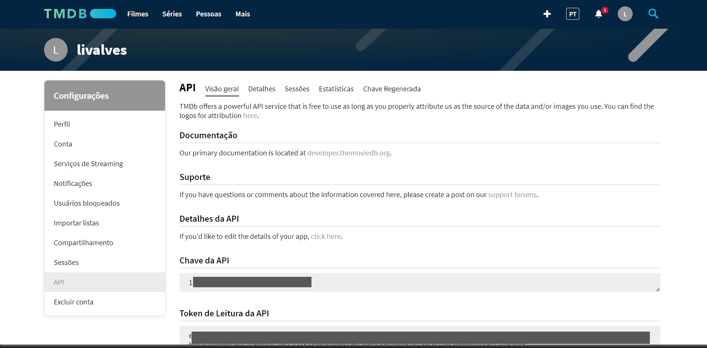
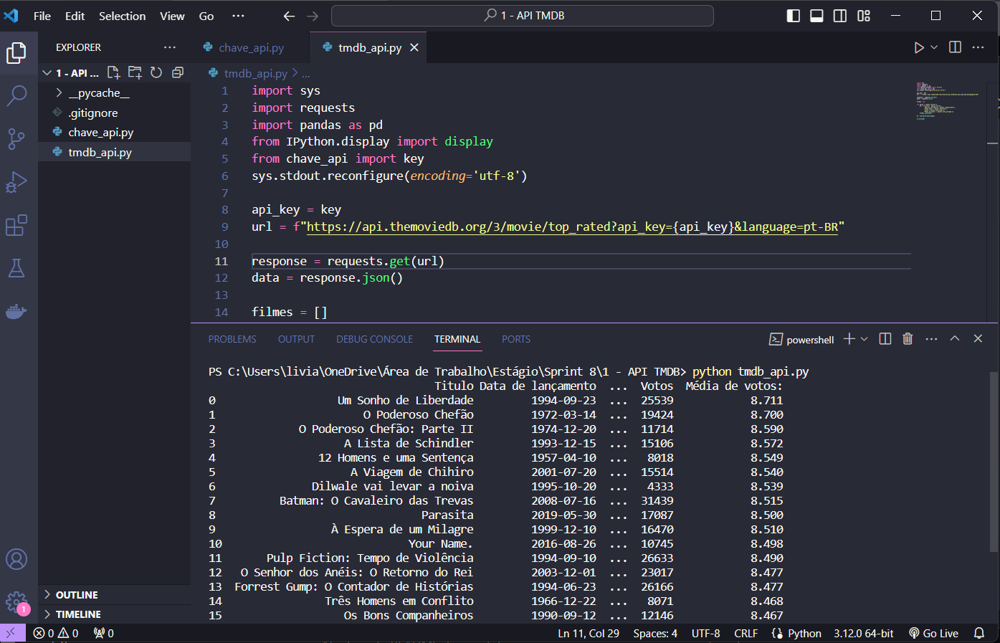

## API TMDB

- Extraindo dados da API do TMDB.

1. Criando e configurando a conta no TMDB para acesso a chave da API.

2. Testando as credenciais geradas e a biblioteca por meio do código python fornecido, acrescido do trecho `sys.stdout.reconfigure(encoding='utf-8')` para que a saída seja formatada corretamente em UTF-8. 

Foi criado um arquivo a parte chamado **chave_api.py** para armazenamento da chave fornecida pela API TMDB, sendo importado no arquivo principal **tmdb_api.py** para requisição.

Para funcionamento do código, deve-se informar a chave de utilização no arquivo *chave_api.py*. 

