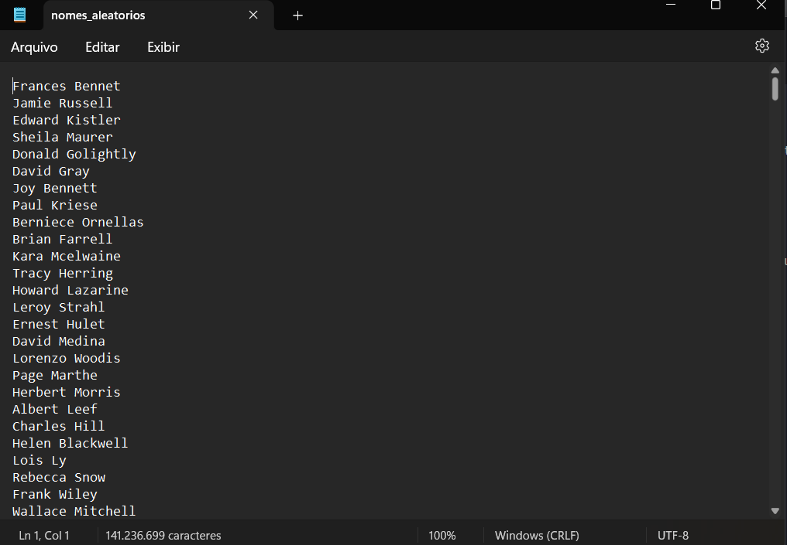

## Geração de massa de dados

1- Em Python, declare e inicialize uma lista contendo 250 inteiros obtidos de forma aleatória. Após, aplicar o método reverse sobre o conteúdo da lista e imprimir o resultado.

- [Código Python](docs/atv-1.py)

2- Em Python, declare e inicialize uma lista contendo o nome de 20 animais. Ordene-os em ordem crescente e itere sobre os itens, imprimindo um a um (você pode utilizar list comprehension aqui).  Na sequência, armazene o conteúdo da lista em um arquivo de texto, um item em cada linha, no formato CSV.

- [Código Python](docs/atv-2.py)

- [Arquivo CSV](docs/animais.csv)

3- Elaborar um código Python para gerar um dataset de nomes de pessoas salvando os dados em um arquivos txt.

- [Código Python](docs/lab/gerador-nomes.py)

> Arquivo TXT gerado

