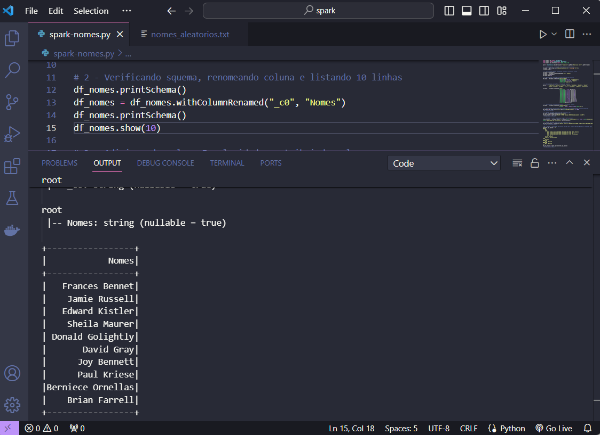
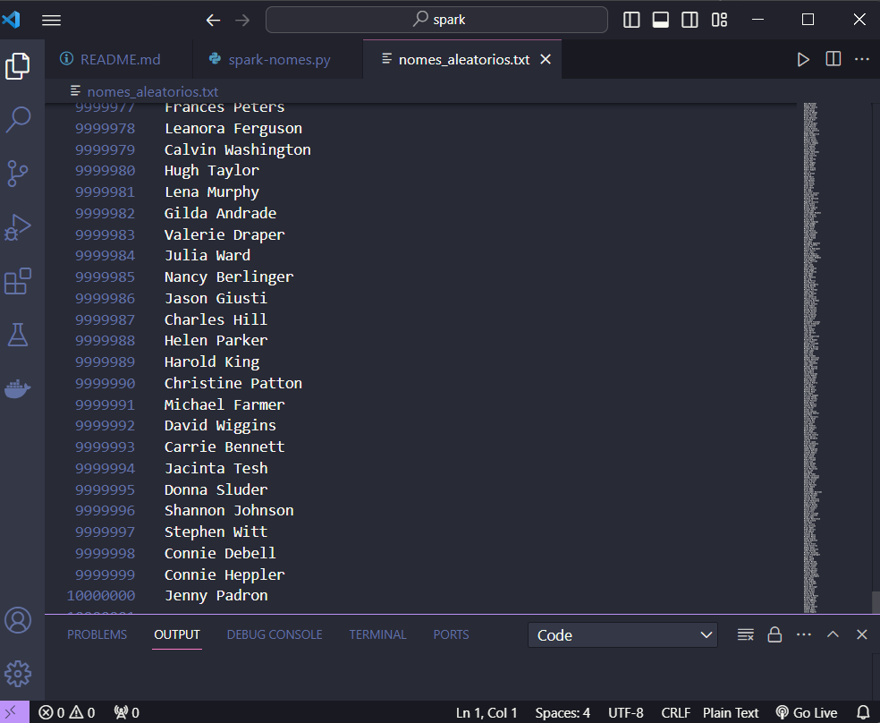
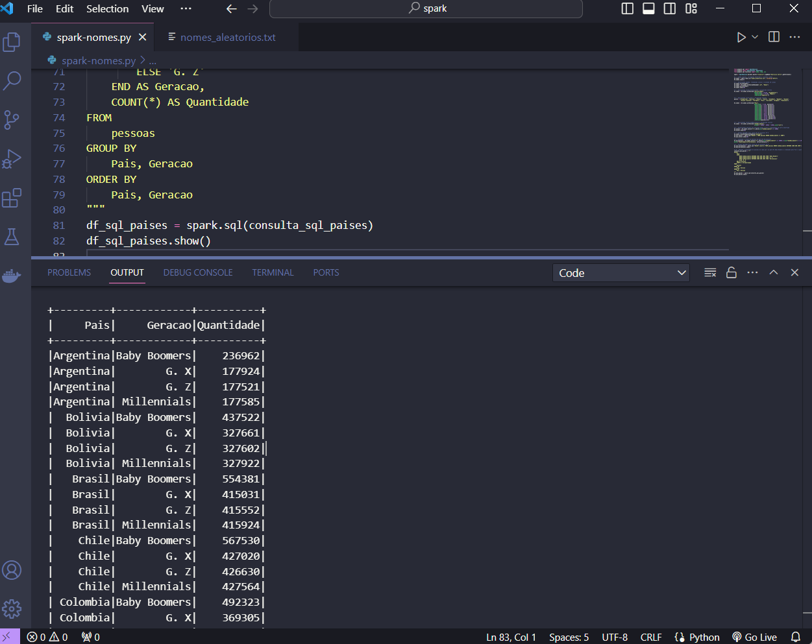

# Apache Spark

- Para realização deste exercício foi utilizado o arquivo nomes_aleatorios.txt gerado com 10 milhoes de nomes pela execução do [exercício anterior](../python/docs//lab/gerador-nomes.py), sendo reutilizado aqui para teste de comandos SQL usando PySpark.

Obs: O arquivo [nomes_aleatorios.txt](docs/nomes_aleatorios.txt) aqui disponibilizado possui caráter simbólico, o qual teve uma redução na quantidade de nomes gerados para que pudesse ser realizado o upload no Github. Os prints abaixo referem-se à execução do código localmente com base no arquivo txt original.

- [Código pyspark](docs/spark-nomes.py)

> Rodando código

> Acessando arquivo txt gerado

> Resultado de consulta
