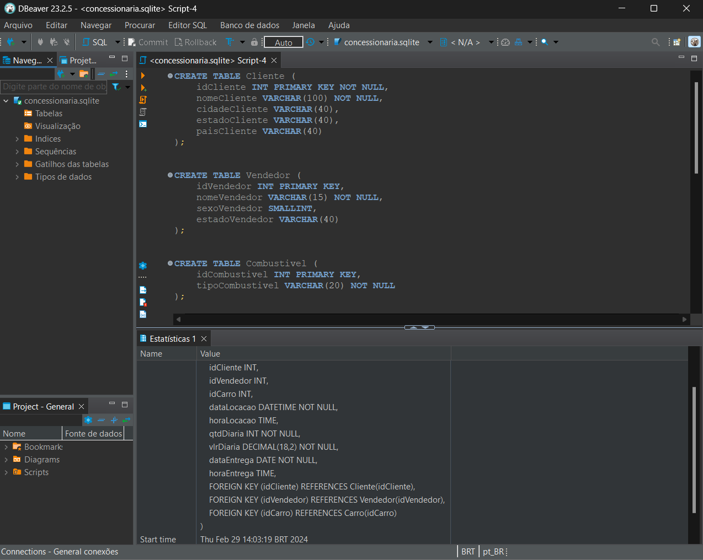
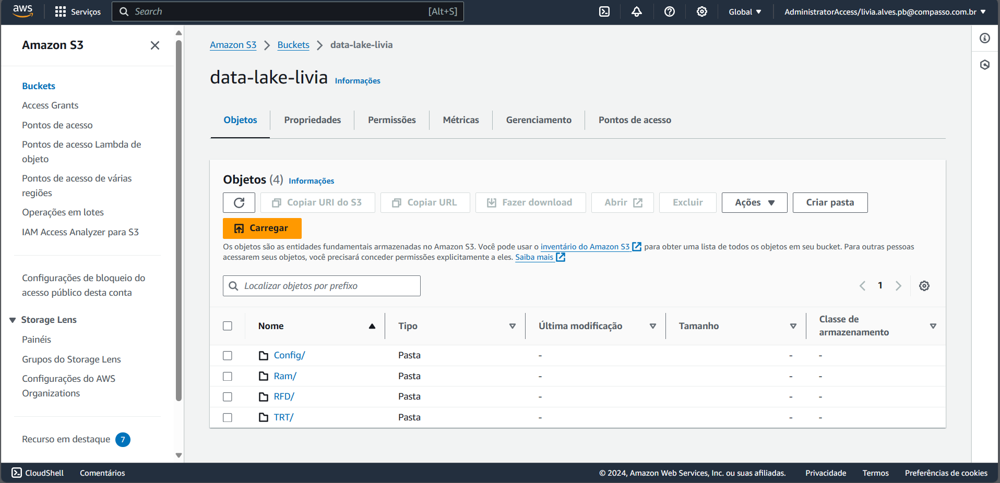

# Sprint 9

> A sprint foi realizada de 26 de fevereiro a 11 de março de 2024 com o objetivo de aprofundar os conhecimentos em modelagem de banco de dados e foco no processamento para limpeza e organização dos dados, visando extrair insights futuros.

## Exercícios  

Para a realização dos seguintes exercícios foi utilizado o cliente DBeaver.

#### 1. [Modelagem Relacional - Concessionária](exercicios/relacional/README.md)

#### 2. [Modelagem Dimencional - Concessionária](exercicios/dimensional/README.md)

#### 3. [Desafio](../desafio/README.md) 

## Evidências

> Criando novas tabelas para normalização de banco de dados.

> Utilizando o bucket S3 para armazenamento dos arquivos processados.
