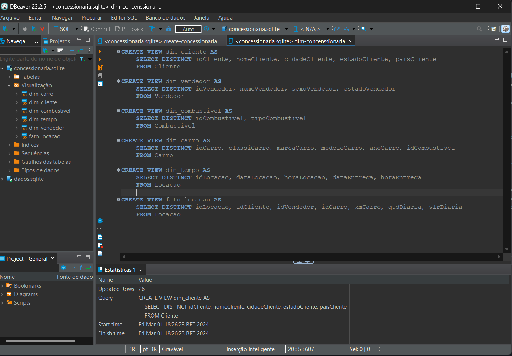
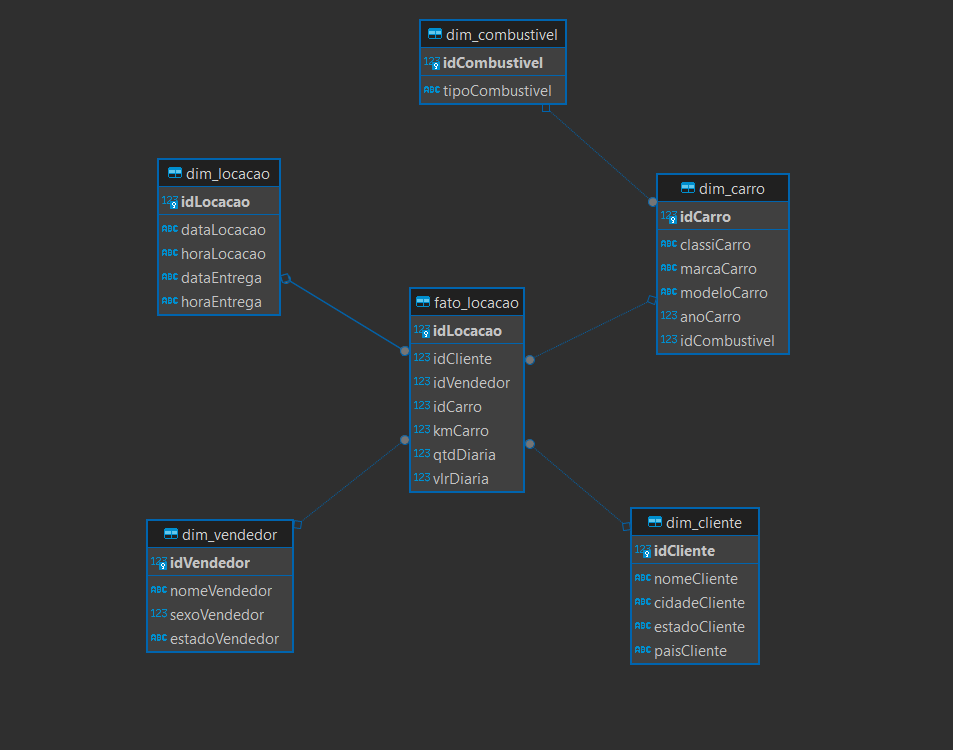

## Modelagem Dimensional - Criação de Modelo

- Realização da modelagem dimensional do banco de dados Concessionaria.

Para melhor análise dos dados no banco, foi realizada a modelagem dimensional, reforçada pela criação das tabelas de dimensões e centralização com a tabela fato.

A modelagem orientada pela seguinte pergunta: **"Qual foi a quilometragem média percorrida por clientes do estado de São Paulo que alugou carros a diesel nos últimos três anos?"**. 

Logo, buscando responder a questão acima, a tabela fato incorporou as principais dimensões `Locacao`, `Cliente`, `Vendedor`e `Carro`, que em complemento, também possui as informações sobre a quantidade e valor da diária, além da quilometragem percorrida em cada locação.

Com os relacionamentos estabelecidos entre as tabelas, torna-se possível consultar cada dimensão a procura dos dados desejados. Em que apenas a tabela `dim_carro` possui um "Outrigger", a tabela `dim_combustivel`, que representa uma tabela de dimensão secundária, normalizando rapidamente o tipo de combustível de cada carro. 

Para resolver a pergunta em questão, com base na tabela `dim_locacao`, é possível filtrar as locações realizadas nos últimos três anos. Em seguida, com a `dim_cliente`, é possível selecionar aqueles do estado de São Paulo. Seguindo com a seleção das locações de carros a diesel pelo `idCombustível` partindo da dimensão carro, finalizando com a média de quilômetros percorridos (kmCarro), disponível na tabela fato.

Seguindo a dica, foi criado a view das tabelas com base no seguinte código SQL:
- [Código SQL](query/dim-concenssionaria.sql)

> Como cliente, também foi utilizado o DBeaver.

> Sendo gerado o diagrama referente a _Modelagem Dimensional_ do banco Concessionaria.

