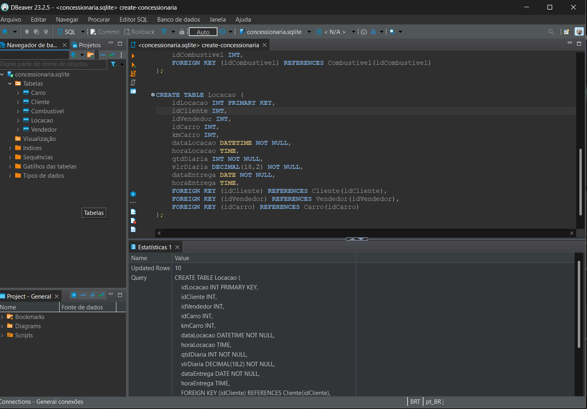
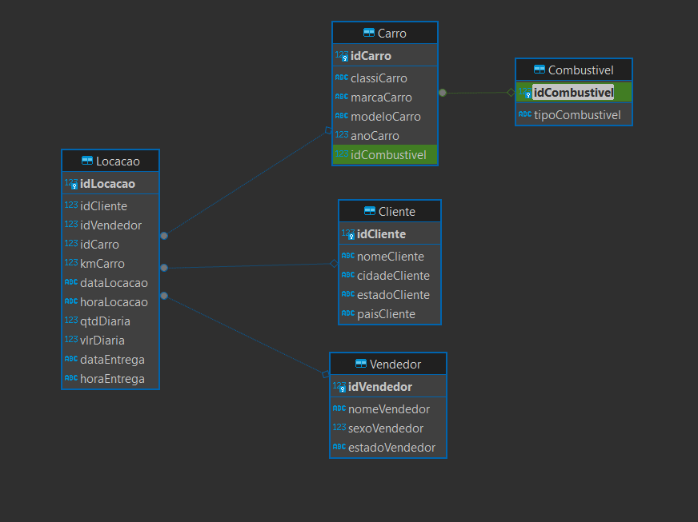

## Modelagem Relacional - Normalização

- Realização da modelagem relacional do banco de dados Concessionaria.

Diante do banco de dados disponibilizado, que não possuía a estruturação adequada, sendo todas as colunas na única tabela `tb_locacao`, realizou-se a normalização com base na aplicação das três formas normais, visando eliminar redundâncias e melhorar a organização dos dados.

Para iniciar a organização, foram selecionadas as principais informações que constroem a `tb_locacao`, transformando-as nas entidades `Cliente`, `Vendedor`, `Locacao`, `Carro` e `Combustivel`, qual cada tabela possui seu próprio ID como chave primária para identificação única de cada registro(linha).

As colunas foram separadas e distribuídas entre as novas entidades de acordo com o relacionamento. Os dados referentes aos _clientes_ agora fazem parte da nova tabela `Clientes`, assim como os dados dos _vendedores_ e os relacionados aos _carros_.

Na tabela `Carro`, também foi informado o `idCombustivel`, que faz referência à sua própria tabela que contém os tipos de combustíveis existentes, visto que mais de um carro pode consumir o mesmo tipo de combustível. 

Já na tabela `Locacao`, foram referenciadas as tabelas `Carro`, `Vendedor` e `Cliente` por meio da utilização da chaves estrangeiras. Foram adicionadas colunas sobre data e hora da locação do veículo, o valor e a quantidade de diárias conforme cada locação e a entrega do veículo locado.

As tabelas foram criadas com base no seguinte código SQL:
- [Código SQL](query/create-concessionaria.sql)

> Como cliente, foi utilizado o DBeaver.

> Sendo gerado o diagrama referente a _Modelagem Lógica_ do banco Concessionaria normalizado.

